
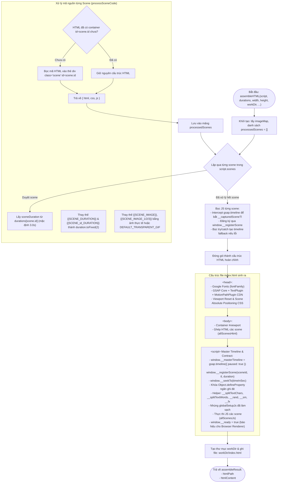
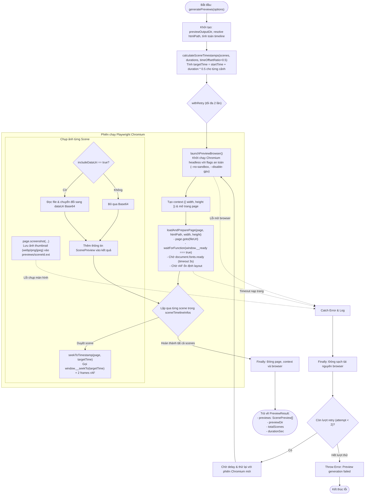
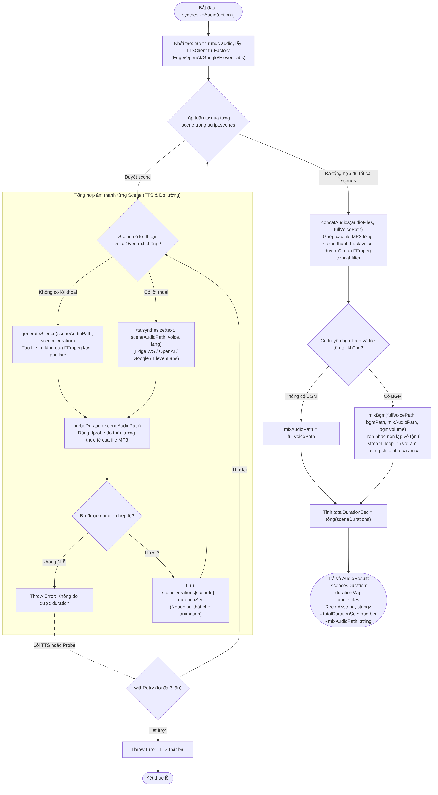

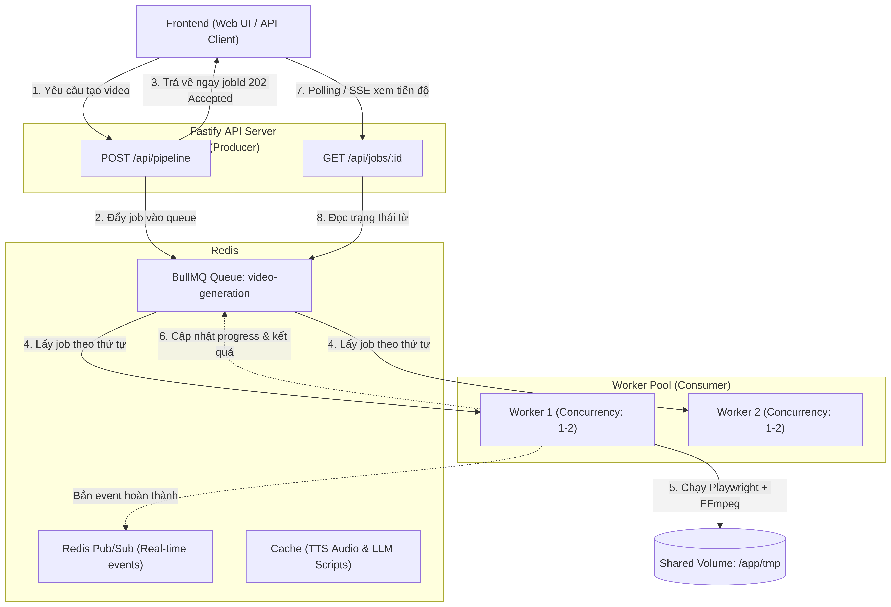

# Báo cáo Tiến độ & Nghiên cứu Dự án (Ngày 04/10)

---

## 1. Giới thiệu tổng quan về dự án

**LIME** là hệ thống tự động tạo video ngắn chất lượng cao từ văn bản thông qua việc kết hợp các công nghệ web hiện đại và LLM. 

Thay vì sử dụng các mô hình khuếch tán video tốn kém tài nguyên máy tính và khó kiểm soát chi tiết, dự án tiếp cận theo hướng:
* Sử dụng **LLM** để sinh kịch bản dưới dạng mã nguồn web cấu trúc cao (**HTML5, CSS3**).
* Sử dụng **GSAP** làm bộ động cơ điều khiển thời gian:
  * **Deterministic Seek-based:** Cho phép Playwright tua chính xác đến từng mili-giây thông qua `window.__seekTo(time)`, loại bỏ hoàn toàn hiện tượng giật lag, mất khung hình do độ trễ phần cứng khi render.
  * **Master Timeline & Đồng bộ âm thanh:** Tự động co giãn thời lượng animation của từng cảnh theo biến `{{SCENE_DURATION}}` khớp chuẩn xác 100% với giọng đọc thực tế đo được từ TTS.
  * **Plugin mạnh mẽ:** Tích hợp `TextPlugin` và `MotionPathPlugin`.
* Sử dụng công nghệ **TTS** để tạo giọng đọc cho từng phân cảnh, đóng vai trò là "nguồn sự thật" quyết định thời lượng animation.
* Sử dụng **Headless Chromium qua Playwright** để trích xuất từng khung hình chuyển động một cách chuẩn xác tuyệt đối (`deterministic seek-based rendering`).
* Sử dụng **FFmpeg** để mã hóa và ghép hợp kênh (mux) âm thanh cùng hình ảnh thành video định dạng MP4 hoàn chỉnh.

Mục tiêu của dự án là tạo ra các video hoạt họa 2D, video giải thích, video dạng truyện tranh/stickman một cách tự động, nhanh chóng, có tính tùy biến cao và tiêu tốn ít chi phí phần cứng hơn rất nhiều so với các mô hình sinh video truyền thống.

---

## 2. Ý hiểu về kiến trúc và quy trình hoạt động của hệ thống

Hệ thống được thiết kế theo kiến trúc phân tách rõ ràng giữa **API Server** và **Background Worker**, giao tiếp với nhau qua hàng đợi và cơ sở dữ liệu:

```
[Client / Browser]
       │
       ▼ (REST / SSE)
┌───────────────────────────┐         ┌───────────────────────────────┐
│     Fastify API Server    │ ──────► │      Redis & SQLite DB        │
│ (Auth, Quota, Endpoints)  │         │ (BullMQ Queues, Sessions, Pub)│
└───────────────────────────┘         └───────────────────────────────┘
                                                      ▲
                                                      │ (Job Polling)
                                      ┌───────────────────────────────┐
                                      │     Worker (src/worker.ts)    │
                                      │  - Draft Worker (Kịch bản)    │
                                      │  - Video Generation Worker    │
                                      └───────────────────────────────┘
                                                      │
                                                      ▼
                                            [Pipeline Orchestrator]
```

### Chi tiết luồng Pipeline toàn trình (Pipeline Phases)

Trái tim của hệ thống nằm ở bộ điều phối `src/pipeline/orchestrator.ts`. Quy trình xử lý toàn trình được mô hình hóa qua sơ đồ tuần tự (Sequence Diagram):


*Sơ đồ điều phối toàn trình của Orchestrator qua các Phase*


---

#### Chi tiết từng giai đoạn trong Pipeline:

#### 1. Sinh kịch bản (Script Generation - `scriptGenerator.ts`)
* Nhận yêu cầu từ người dùng (chủ đề, tỷ lệ khung hình, ngôn ngữ, phong cách).
* LLM sinh ra cấu trúc kịch bản theo schema JSON nghiêm ngặt (`VideoScriptSchema`). Mỗi scene gồm có lời thoại (`voiceOverText`), mã giao diện (`htmlCode`, `cssCode`) và mã chuyển động GSAP (`jsCode`).
* Sử dụng placeholder `{{SCENE_DURATION}}` thay vì gắn thời gian cố định.
* Tự động thử lại (Retry) nếu JSON sinh ra bị lỗi cú pháp.



---

#### 2. Ước lượng thời lượng (Estimate Duration - `estimateDuration.ts`)
* Dựa vào số từ và ngôn ngữ (hệ số WPM), hệ thống tính toán sơ bộ độ dài của từng scene.
* Chặn sớm các kịch bản quá dài (vượt > 50% thời lượng mục tiêu) để tránh lãng phí tài nguyên.


---

#### 3. Lắp ráp HTML tạm thời (Assemble HTML - `assembleHtml.ts`)
* Đưa code của các scene vào template tổng, gắn các thư viện GSAP, TextPlugin, MotionPathPlugin, cùng các helper dựng nhân vật que (`window.__sm()`) và hiệu ứng comic (`window.__fx()`).
* Tạm thời thay thế `{{SCENE_DURATION}}` bằng thời lượng ước lượng để chuẩn bị cho bước preview.



---

#### 4. Chụp ảnh xem trước (Preview Thumbnails - `preview.ts`)
* Khởi động Chromium, tải trang HTML và tua (`__seekTo`) tới **chính giữa (midpoint)** của từng phân cảnh.
* Chụp ảnh thumbnail WebP cho từng cảnh.
* **Mục đích:**
  * **Cơ chế Fail-Fast:** Phát hiện sớm các lỗi cú pháp JS, lỗi DOM, crash animation trước khi bước vào các công đoạn tốn kém tiền bạc và thời gian (TTS, Render).
  * **Trải nghiệm Storyboard:** Cung cấp ảnh trực quan cho người dùng kiểm tra trên giao diện trước khi render video hoàn chỉnh.
  * **Thu thập chẩn đoán (Diagnostic Dump):** Nếu xảy ra lỗi, hệ thống tự chụp snapshot lỗi DOM và trạng thái GSAP để hỗ trợ gỡ lỗi.



---

#### 5. Tổng hợp giọng đọc & Âm thanh (Audio Synthesis - `audioSysnthesis.ts`)
* Gửi lời thoại từng scene tới các dịch vụ TTS (Edge TTS, ElevenLabs, OpenAI, Google, VieNeu).
* Dùng `ffprobe` để đo chính xác thời lượng file audio đến từng mili-giây.
* **Thời lượng TTS chính là "Nguồn sự thật" (Source of Truth)** quyết định độ dài của từng cảnh trong video.
* Ghép các file âm thanh và trộn nhạc nền (BGM) ở mức âm lượng hợp lý (~15%).



---

#### 6. Tái lắp ráp HTML chính thức (`assembleHtml.ts`)
* Thay thế các placeholder `{{SCENE_DURATION}}` bằng thời lượng thực tế đo được từ audio.
* Đảm bảo chuyển động hoạt hình khớp 100% với giọng đọc.

---

#### 7. Render từng khung hình & Đóng gói Video (`renderer.ts`)
* Chromium mở trang HTML ở độ phân giải thiết lập (ví dụ: 1920x1080 hoặc 1080x1920).
* Chạy vòng lặp 30 FPS: ở mỗi frame, gọi `window.__seekTo(time)`, chụp ảnh đệm (buffer) và truyền trực tiếp qua pipe (`image2pipe`) vào tiến trình FFmpeg.
* FFmpeg kết hợp luồng ảnh và audio track để đóng gói ra file MP4 cuối cùng (`final_video.mp4`).



---


## 3. Các công việc và thành phần đã nghiên cứu & triển khai

Trong quá trình phát triển dự án, các mảng công việc chính đã được tập trung nghiên cứu, xây dựng và hoàn thiện:

### 3.1. Hệ thống Hàng đợi Bất đồng bộ (Queue & Background Worker)
* **Vấn đề:** Quá trình sinh kịch bản và render video tiêu tốn nhiều thời gian (vài chục giây đến vài phút) và CPU, không thể chạy trực tiếp trên luồng request của API server.
* **Giải pháp đã thực hiện:**
  * Xây dựng kiến trúc xử lý tác vụ nền với **BullMQ và Redis**, hỗ trợ cơ chế tự động chuyển đổi sang bộ nhớ trong (**in-memory fallback**) khi Redis không khả dụng.
  * Tách biệt các hàng đợi:
    * `script-draft`: Xử lý sinh nháp kịch bản cho người dùng duyệt trước (Draft Flow).
    * `video-generation`: Xử lý render toàn bộ video.
  * Tích hợp cơ chế **Pub/Sub và Server-Sent Events (SSE)** để đẩy tiến trình (`onProgress`) theo thời gian thực về giao diện người dùng.



---

## 4. Báo cáo đóng góp của từng thành viên (Phân chia theo Commit)

Toàn bộ dự án được phối hợp phát triển chặt chẽ giữa 5 thành viên, phân chia nhiệm vụ theo từng module cốt lõi và tích hợp thông qua hệ thống Git & Pull Request:

### 4.1. Thành viên: Nguyễn Quang Khánh (noqokhxnh)
* **Vai trò:** Trưởng nhóm, Thiết kế kiến trúc tổng thể & Điều phối Pipeline cốt lõi.
* **Các mảng phụ trách chính:**
  * Thiết kế kiến trúc Pipeline toàn trình (`orchestrator.ts`) và cơ chế đồng bộ âm thanh - chuyển động.
  * Nghiên cứu & hoàn thiện hệ thống System Prompt, Style Presets cho LLM.
  * Tích hợp các nhà cung cấp TTS và xây dựng microservice VieNeu-TTS.
  * Xây dựng cơ chế Retry đa tầng với Exponential Backoff.
  * Hoàn thiện bảo mật Google OAuth, đóng gói hệ thống, tài liệu và sơ đồ kiến trúc UML.
* **Chi tiết đóng góp phân theo Commit:**
  * `88498f7`: *docs: add project architectural UML* — Thiết kế sơ đồ lớp và tuần tự UML cho toàn bộ hệ thống.
  * `208d40d`: *feat(prompt): improve system prompt with visual design standards and screen-vs-voice rules* — Cải tiến system prompt, phân định rõ ràng giữa nội dung hiển thị màn hình và lời thoại đọc.
  * `d018bc4`, `c7e2248`: *feat(style): define style presets and sync videoRequestSchema* — Định nghĩa các bộ phong cách đồ họa (stickman, modern, editorial,...) và đưa các quy tắc sản xuất vào prompt người dùng.
  * `fd83a49`, `d27cf85`, `5623e42`, `607caee`, `d54eb76`: *feat: add retry utility with exponential backoff & per-scene retry* — Xây dựng tiện ích retry toàn cục với exponential backoff cho script generator, tổng hợp audio từng cảnh, preview và video rendering.
  * `95e3bb5`: *feat(llm): add 9router provider with Docker host gateway discovery and token pricing* — Tích hợp provider LLM 9router, tự động dò tìm Docker host gateway và tính toán chi phí token.
  * `d30f3d3`: *feat(tts): add VieNeu-TTS local AI provider with Docker microservice* — Tích hợp mô hình giọng đọc VieNeu-TTS chạy cục bộ qua Docker microservice.
  * `31357d4`: *feat(auth): complete Google OAuth flow, timing-safe state check & config endpoint* — Hoàn thiện luồng Google OAuth bảo mật cao với kiểm tra state chống giả mạo timing-safe.
  * `241cb32`, `4660d7e`: *fix(debug), fix(test)* — Sửa lỗi tích hợp pipeline, đồng bộ tham số assembleHtml và cấu hình queue test.
  * `37e38db`: *docs: update README, brand assets, Docker setup, and gitignore* — Cập nhật toàn diện tài liệu README, hình ảnh thương hiệu và cấu hình Docker.

---

### 4.2. Thành viên: Trần Khánh Duy (`duytrancoder`)
* **Vai trò:** Backend & DevOps, Phụ trách Hàng đợi, Bảo mật & Chẩn đoán hệ thống.
* **Các mảng phụ trách chính:**
  * Xây dựng hệ thống Background Worker và hàng đợi bất đồng bộ với Redis BullMQ.
  * Xây dựng cơ chế an ninh, phòng chống Prompt Injection và Rate Limiting đa tầng.
  * Xây dựng hệ thống giám sát chẩn đoán pipeline (Pipeline Diagnostics & Crash Snapshots).
  * Đóng gói Dockerfile môi trường Playwright headless và cấu hình Docker Compose.
* **Chi tiết đóng góp phân theo Commit:**
  * `76307d0`: *feat(queue): background worker with Redis BullMQ & in-memory fallback (#15)* — Xây dựng worker xử lý tác vụ nền với BullMQ trên Redis, tách hàng đợi draft/render và bổ sung cơ chế fallback in-memory khi không có Redis.
  * `6969971`: *feat(security): prompt injection guard & multi-tier rate limiter (#16)* — Hiện thực bộ lọc chống tấn công Prompt Injection và giới hạn tần suất đa tầng theo IP / người dùng.
  * `b5513d6`: *feat(debug): pipeline diagnostics, browser error tracing & crash snapshots (#39)* — Tích hợp bộ theo dõi lỗi trình duyệt Chromium (Console, PageError, RequestFailed) và tự động xuất ảnh chụp snapshot + cây DOM khi gặp crash.
  * `1884a72`, `e66fdc0`: *build(docker): setup Dockerfile with base Playwright image and system dependencies* — Tạo Dockerfile đa tầng trên nền Playwright base image, tối ưu non-root user và cài đặt đầy đủ thư viện đồ họa hệ thống.
  * `921211c`, `3a5ed04`: *build(docker): complete docker-compose.yml with volume and shm_size* — Cấu hình `docker-compose.yml` hoàn chỉnh với cấu hình bộ nhớ chia sẻ `shm_size` chống crash Chromium.
  * `a9f887c`: *chore(docker): add .dockerignore to exclude local files from build context* — Tối ưu hóa dung lượng build context cho Docker.

---

### 4.3. Thành viên: Nguyễn Văn Điệp (`PunishedK` / `Van Diep`)
* **Vai trò:** Backend & Frontend Auth, Phụ trách Cơ sở dữ liệu và Hệ thống Xác thực.
* **Các mảng phụ trách chính:**
  * Thiết kế cơ sở dữ liệu SQLite cho bảng người dùng và phiên làm việc (`users`, `sessions`).
  * Xây dựng toàn bộ hệ thống xác thực cục bộ (Local Authentication: Đăng ký, Đăng nhập, Đăng xuất).
  * Xây dựng giao diện Modal xác thực và tích hợp luồng Đăng nhập qua Google (Google OAuth 2.0).
* **Chi tiết đóng góp phân theo Commit:**
  * `46b5dc5`, `83a1dc2`, `3219598`: *chore(auth): add authentication dependencies, local db config* — Thêm các thư viện xác thực, cấu hình kết nối database trong file env và config.ts.
  * `6d06250`, `05c9daa`, `dda6b58`: *feat: add simple authdb skema, sessions table* — Thiết kế cấu trúc bảng `users`, bảng `sessions` lưu trữ token và khởi tạo cơ sở dữ liệu.
  * `742a4f2`: *chore(auth): add session config* — Cấu hình cookie phiên người dùng an toàn.
  * `3550b25`, `c4f4d98`: *feat(auth): add local auth api, register backend* — Hiện thực các API xác thực cục bộ và logic đăng ký tài khoản mới.
  * `3d16bf6`, `ba18757`: *feat(auth): simple login, simple logout* — Hiện thực logic đăng nhập và đăng xuất người dùng.
  * `a4fcf64`: *feat: update auth ui* — Thiết kế và cập nhật giao diện modal đăng nhập/đăng ký người dùng trên Frontend.
  * `b1514b0`, `36d3b95`: *fix(auth): them email vao query dangnhap, add flatten error* — Bổ sung hỗ trợ đăng nhập bằng email và chuẩn hóa thông báo lỗi validation.
  * `66b2c8b`, `6c76b8b`: *chore(auth): add Google OAuth configuration, install jose* — Cấu hình Google OAuth và cài đặt thư viện `jose` phục vụ giải mã JWT.
  * `952b2ff`, `972a6dd`, `f875285`: *feat(auth): add googleauth redirect, add gg login flow, feat: google login fe* — Xây dựng luồng chuyển hướng xác thực Google OAuth và kết nối đăng nhập Google trên giao diện.
  * `78dde50`, `3567dda`: *fix(auth): improve Google OAuth error handling, show Google OAuth errors in login modal* — Bắt lỗi và hiển thị thông báo lỗi chi tiết khi người dùng đăng nhập Google không thành công.

---

### 4.4. Thành viên: Uy (`uydayy`)
* **Vai trò:** Feature Templates / Motion Design Toolkit — nâng cấp chất lượng thị giác video do AI sinh ra.
* **Issue phụ trách:** [#43 — Templates: 50+ Studio Motion Blocks & Cinematic Blueprints Catalog](https://github.com/noqokhxnh/LIME/issues/43) (`priority: high`).
* **Các mảng phụ trách chính:**
  * Nghiên cứu mô hình Motion Blocks của Hyperframes và thiết kế kiến trúc phù hợp LIME (`window.__block` inject qua assembler, không phụ thuộc CDN ngoài GSAP).
  * Xây dựng module `src/templates/` gồm types, 5 core runtime blocks, catalog 61 blocks + 8 blueprints, story spine 5 nhịp và prompt formatters.
  * Cập nhật `system.txt` + `scriptGenerator.buildUserPrompt` để LLM ưu tiên gọi block runtime và tuân thủ cấu trúc Hook → Problem → Insight → Proof → CTA.
  * Mở rộng `videoRequestSchema` (`blueprintId`, `motionBlockIds`) và API `GET /api/catalog`, `/api/catalog/blocks`, `/api/catalog/blueprints`.
  * Bổ sung panel Templates trên Studio (`frontend/`) — chọn style, blueprint, tối đa 8 motion blocks khi gọi `/api/pipeline`.
  * Viết unit test catalog + mở rộng assembler test xác nhận HTML chứa `__block` và 5 core ids.
* **Chi tiết đóng góp (working tree / nhánh `feature/uy-43-templates`, chưa merge main tại thời điểm báo cáo):**
  * `src/templates/**` — Module catalog & runtime mới (core blocks, recipes, blueprints, story spine, prompt helpers).
  * `src/pipeline/assembleHtml.ts` — Inject `BLOCK_HELPERS_JS` vào mọi trang render.
  * `src/llm/system.txt`, `src/pipeline/scriptGenerator.ts` — Toolkit + cinematic spine trong prompt.
  * `src/llm/schema.ts`, `src/index.ts` — Schema request + REST catalog.
  * `frontend/index.html`, `frontend/app.js`, `frontend/style.css` — UI chọn Templates.
  * `tests/unit/templates.test.ts`, `tests/unit/assembler.test.ts` — Kiểm thử nghiệm thu kỹ thuật (20/20 pass trên hai file này).
* **Ghi chú vận hành khi kiểm thử end-to-end:**
  * Local: Postgres cần database `vidtml`; `QUEUE_TYPE=memory` chạy được chỉ với `npm run dev`.
  * Generate video thật cần LLM key hợp lệ (Gemini dạng `AIza...`; DeepSeek cần còn credit).

---

## 5. Các Video đã tạo ra từ dự án
* [Video 1: Giới thiệu dự án hoạt họa 2D](public/video_1.mp4)
* [Video 2: Demo kịch bản giải thích](public/video_2.mp4)
