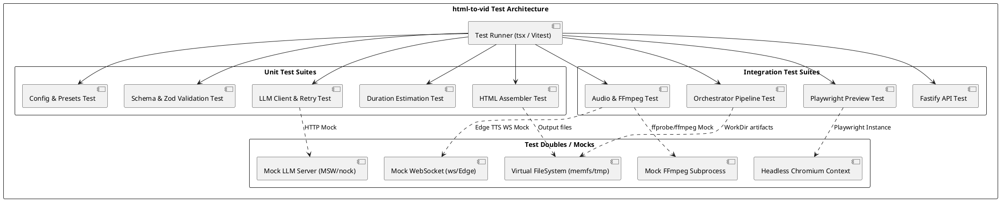
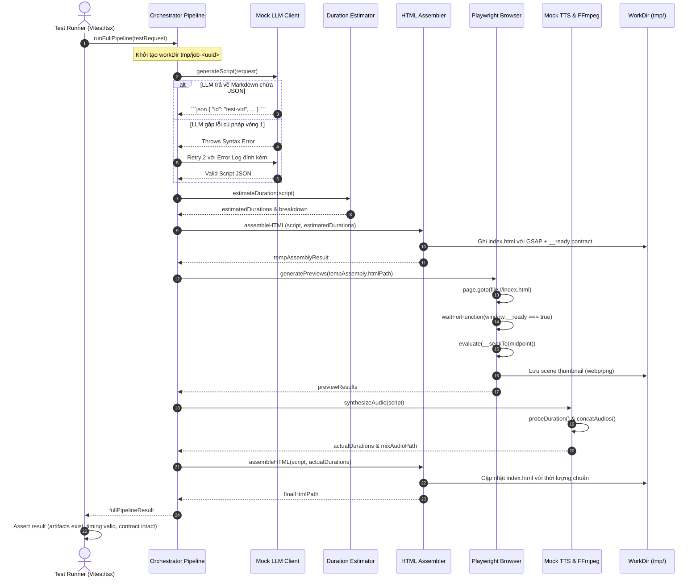
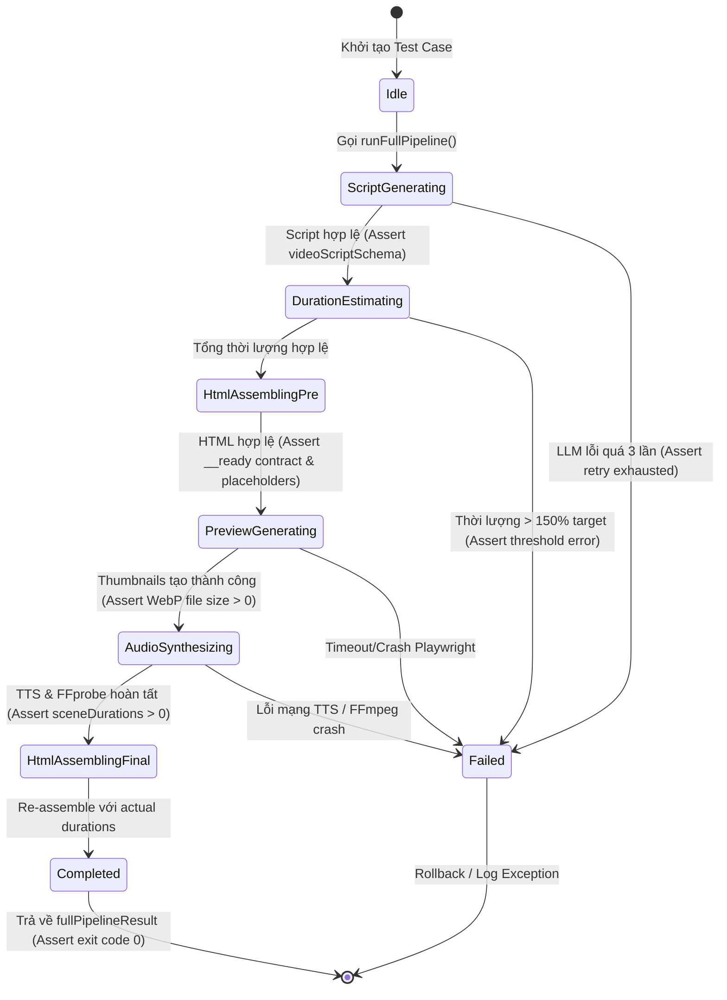
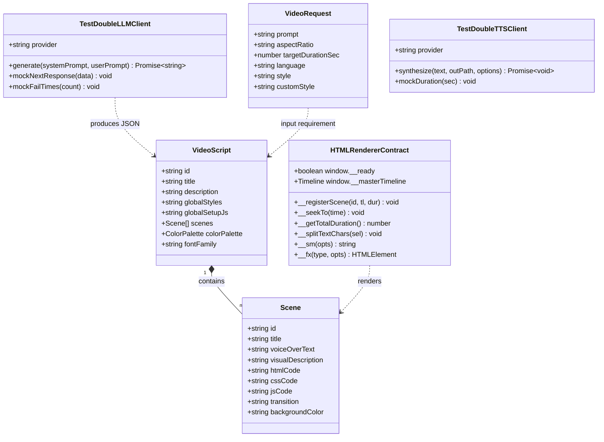
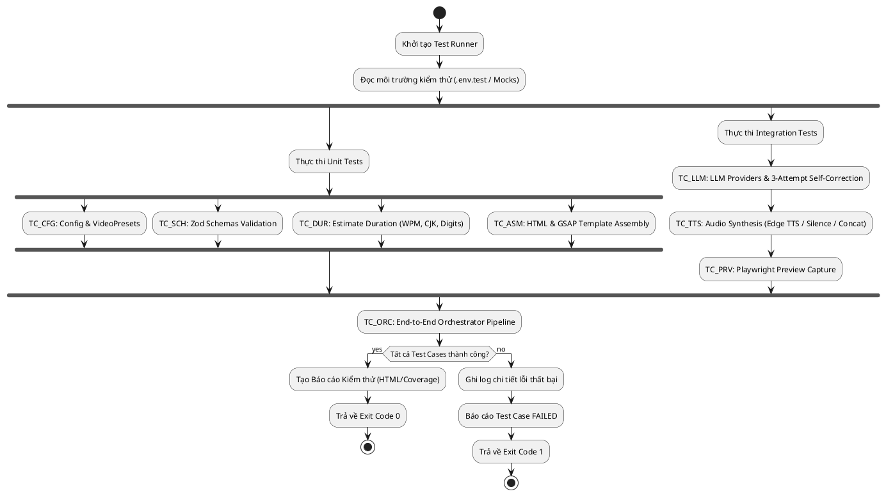

# Tài Liệu Thiết Kế Test Case (Test Case Design Document)
**Dự Án:** VidTML — AI-Powered HTML Animation Video Generator (`html-to-vid`)  
**Phiên Bản Tài Liệu:** 1.0.0  
**Ngày Ban Hành:** 2026-09-04  
**Trạng Thái:** Đã Thẩm Định Kiến Trúc (Architecture Approved)

---

## 1. Tổng Quan Về Tài Liệu (Document Overview)

### 1.1 Mục Đích (Purpose)
Tài liệu này xác định chiến lược kiểm thử toàn diện, kiến trúc kiểm thử, và danh mục test case chi tiết cho dự án **VidTML (`html-to-vid`)**. Mục tiêu là đảm bảo chất lượng phần mềm, độ tin cậy của pipeline tạo video tự động (từ Prompt người dùng -> Kịch bản LLM -> Giọng đọc TTS -> Mã HTML/GSAP -> Preview Screenshots -> Render Video & Mux MP4), đồng thời bảo vệ các hợp đồng kỹ thuật nghiêm ngặt (strict contracts) giữa HTML và trình duyệt headless (Chromium).

### 1.2 Phạm Vi Kiểm Thử (Scope of Testing)
* **Trong phạm vi (In-Scope):**
  * Module Cấu hình & Biến môi trường (`src/config.ts`).
  * Module Schema & Data Contracts (`src/llm/schema.ts`).
  * Module LLM Client & Cơ chế Self-Correction Retry (`src/llm/client.ts`, `src/pipeline/scriptGenerator.ts`).
  * Thuật toán Ước lượng Thời lượng Giọng đọc (`src/pipeline/estimateDuration.ts`).
  * Hệ thống Tổng hợp Âm thanh TTS, Đo đạc ffprobe & Trộn nhạc nền FFmpeg (`src/pipeline/audioSysnthesis.ts`).
  * Trình Đóng gói Mã nguồn HTML, CSS & GSAP Master Timeline (`src/pipeline/assembleHtml.ts`).
  * Module Sinh Ảnh Xem Trước Thumbnail qua Playwright (`src/pipeline/preview.ts`).
  * Điều Phối Toàn Trình Pipeline Orchestrator (`src/pipeline/orchestrator.ts`).
  * API Server Fastify & Healthcheck Endpoint (`src/index.ts`).
* **Ngoài phạm vi (Out-of-Scope):**
  * Đánh giá chất lượng nghệ thuật chủ quan của LLM (thẩm mỹ nội dung).
  * Kiểm thử tải cơ sở hạ tầng mạng bên ngoài (OpenAI / Google / ElevenLabs uptime).

### 1.3 Đối Tượng Sử Dụng (Target Audience)
* **QA / Automation Engineers:** Thiết kế kịch bản test tự động, bảo trì test suite.
* **Backend / Pipeline Developers:** Viết Unit Test và Integration Test trước/sau khi phát triển tính năng.
* **Tech Lead / DevOps:** Tích hợp CI/CD pipeline, theo dõi độ bao phủ code (code coverage).

---

## 2. Kiến Trúc Kiểm Thử & Chiến Lược Mocking (Testing Architecture & Strategy)

Hệ thống tuân thủ mô hình **Testing Pyramid** và phương pháp **Shift-Left Testing**:
1. **Unit Tests (Chiếm ~60%):** Kiểm tra các hàm logic độc lập, thuần túy (pure functions) như ước lượng thời lượng (WPM, CJK, digits, pause), parsing schema Zod, bóc tách chuỗi JSON, kiểm tra thế chỗ biến token HTML/CSS/JS.
2. **Integration Tests (Chiếm ~30%):** Kiểm tra tích hợp giữa các thành phần nội bộ với các dịch vụ bên ngoài (LLM, TTS, FFmpeg, Playwright Chromium) sử dụng cơ chế Test Doubles/Mocking:
   * **LLM Mocking:** Giả lập phản hồi JSON hợp lệ, phản hồi lỗi cú pháp để kiểm tra vòng lặp tự sửa lỗi (Self-Correction Retry).
   * **TTS WebSocket Mocking:** Giả lập giao thức nhị phân WebSocket Edge TTS (`Sec-MS-GEC`, frame headers, MP3 chunks).
   * **FFmpeg/ffprobe Mocking / Sandbox:** Sử dụng file âm thanh mẫu thực tế hoặc dummy audio để đo `ffprobe` và ghép kênh `concatAudios`.
   * **Playwright Headless Sandbox:** Chạy kiểm thử chụp màn hình với Chromium sandboxed/no-sandbox trên file HTML thật do pipeline sinh ra.
3. **End-to-End Orchestrator Pipeline Tests (Chiếm ~10%):** Chạy toàn bộ luồng từ request đầu vào đến kết quả trả về với Mock LLM và Fast Audio để kiểm tra trạng thái thư mục `tmp/job-<uuid>`, tiến trình `onProgress`, và các chỉ số đo lường thời gian (timing).

---

## 3. Mô Hình Hóa UML & Biểu Đồ Mermaid Cho Quy Trình Kiểm Thử

### 3.1 Sơ Đồ Kiến Trúc Hệ Thống Kiểm Thử (PlantUML Component Diagram)
Sơ đồ thể hiện cấu trúc Test Suite, Runner và các Test Doubles (Mocks):



---

### 3.2 Luồng Tương Tác Trong Test Suite Tích Hợp (Mermaid Sequence Diagram)
Biểu đồ tuần tự thể hiện việc kiểm thử quy trình tạo video có kết hợp Mock Service và xác thực Contract:



---

### 3.3 Biểu Đồ Trạng Thái Pipeline & Điểm Kiểm Thử (Mermaid State Diagram)
Mô hình hóa các trạng thái chuyển giao (phase transitions) và các điểm kiểm thử bắt buộc (assertion points):



---

### 3.4 Biểu Đồ Lớp Kiểm Thử & Hợp Đồng Dữ Liệu (Mermaid Class Diagram)
Cấu trúc quan hệ giữa Test Suites, Data Interfaces và Mock Adapters:



---

### 3.5 Quy Trình Thực Thi Test Suite Toàn Trình (PlantUML Activity Diagram)



---

## 4. Ma Trận Truy Xuất Yêu Cầu (Traceability Matrix)

| Yêu Cầu Kỹ Thuật (Requirement) | Module Nguồn | Test Suite | Test Case IDs | Mức Độ Ưu Tiên |
| :--- | :--- | :--- | :--- | :--- |
| **REQ-CFG-01**: Tự động load và validate biến môi trường với Zod | `src/config.ts` | ConfigTestSuite | TC-CFG-001, TC-CFG-002 | P0 (Blocker) |
| **REQ-CFG-02**: Ánh xạ đúng tỷ lệ khung hình và độ phân giải | `src/config.ts` | ConfigTestSuite | TC-CFG-003, TC-CFG-004 | P1 (Critical) |
| **REQ-SCH-01**: Kiểm tra tính toàn vẹn của DTO Input/Output | `src/llm/schema.ts` | SchemaTestSuite | TC-SCH-001 to TC-SCH-004 | P0 (Blocker) |
| **REQ-LLM-01**: Kết nối đa nhà cung cấp LLM (OpenAI, Gemini, Claude, DeepSeek) | `src/llm/client.ts` | LLMTestSuite | TC-LLM-001, TC-LLM-002 | P1 (Critical) |
| **REQ-LLM-02**: Khả năng tự sửa lỗi (Self-Correction Retry 3 lần) | `src/pipeline/scriptGenerator.ts` | LLMTestSuite | TC-LLM-003, TC-LLM-004, TC-LLM-005 | P0 (Blocker) |
| **REQ-DUR-01**: Ước lượng chính xác số từ (Latin, CJK, Số nguyên) | `src/pipeline/estimateDuration.ts` | DurationTestSuite | TC-DUR-001, TC-DUR-002, TC-DUR-003 | P1 (Critical) |
| **REQ-DUR-02**: Tính khoảng dừng theo dấu câu & thời lượng tối thiểu | `src/pipeline/estimateDuration.ts` | DurationTestSuite | TC-DUR-004 to TC-DUR-007 | P1 (Critical) |
| **REQ-TTS-01**: Tạo token Edge TTS `Sec-MS-GEC` & giao tiếp WebSocket | `src/pipeline/audioSysnthesis.ts` | AudioTestSuite | TC-TTS-001, TC-TTS-002, TC-TTS-003 | P0 (Blocker) |
| **REQ-TTS-02**: Xử lý scene im lặng & đo đạc ffprobe chính xác | `src/pipeline/audioSysnthesis.ts` | AudioTestSuite | TC-TTS-004, TC-TTS-005 | P1 (Critical) |
| **REQ-TTS-03**: Ghép nối âm thanh & trộn nhạc nền BGM | `src/pipeline/audioSysnthesis.ts` | AudioTestSuite | TC-TTS-006, TC-TTS-007, TC-TTS-008 | P1 (Critical) |
| **REQ-ASM-01**: Thay thế biến placeholder & fallback ảnh trong suốt | `src/pipeline/assembleHtml.ts` | AssemblerTestSuite | TC-ASM-001, TC-ASM-002, TC-ASM-003 | P0 (Blocker) |
| **REQ-ASM-02**: Đóng gói GSAP Master Timeline & Helper APIs | `src/pipeline/assembleHtml.ts` | AssemblerTestSuite | TC-ASM-004 to TC-ASM-007 | P0 (Blocker) |
| **REQ-PRV-01**: Playwright Chromium khởi tạo an toàn & chụp midpoint | `src/pipeline/preview.ts` | PreviewTestSuite | TC-PRV-001 to TC-PRV-006 | P1 (Critical) |
| **REQ-ORC-01**: Điều phối toàn trình, quản lý thư mục tmp & timing | `src/pipeline/orchestrator.ts` | OrchestratorTestSuite | TC-ORC-001 to TC-ORC-006 | P0 (Blocker) |
| **REQ-API-01**: Máy chủ Fastify khởi động, CORS & endpoint health | `src/index.ts` | APIServerTestSuite | TC-API-001, TC-API-002 | P2 (Normal) |

---

## 5. Danh Mục Thiết Kế Chi Tiết Test Cases (Detailed Test Specifications)

### 5.1 Module 1: Cấu Hình & Môi Trường (`src/config.ts`)

#### Test Case TC-CFG-001: Nạp cấu hình mặc định khi không có biến môi trường
* **Mục đích:** Đảm bảo hệ thống sử dụng đúng các giá trị mặc định được định nghĩa trong `envSchema`.
* **Loại test:** Unit Test | **Độ ưu tiên:** P1
* **Tiền điều kiện:** `process.env` được làm sạch các biến cấu hình.
* **Dữ liệu đầu vào:** `{}` (empty env).
* **Các bước thực hiện:**
  1. Xóa cache singleton `_config`.
  2. Gọi `getConfig()`.
* **Kết quả mong đợi:**
  * `PORT` = `3000`
  * `NODE_ENV` = `'development'`
  * `LLM_Provider` = `'gemini'`
  * `TTS_Provider` = `'edge'`
  * `Default_FPS` = `30`
  * `Default_Width` = `1920`, `Default_Height` = `1080`.

#### Test Case TC-CFG-002: Bắt lỗi khi biến môi trường không đúng kiểu hoặc ngoài enum
* **Mục đích:** Ngăn chặn ứng dụng khởi động khi cấu hình sai.
* **Loại test:** Negative Unit Test | **Độ ưu tiên:** P0
* **Tiền điều kiện:** Không.
* **Dữ liệu đầu vào:** `process.env.LLM_Provider = "unknown_ai"`, `process.env.PORT = "abc"`.
* **Các bước thực hiện:**
  1. Gán biến môi trường không hợp lệ.
  2. Gọi hàm `getConfig()`.
* **Kết quả mong đợi:** Hàm ném ra ngoại lệ `Error` chứa nội dung `Configuration error: ...` và liệt kê lỗi chi tiết từ Zod.

#### Test Case TC-CFG-003: Xác minh bảng Video Presets và tỷ lệ khung hình
* **Mục đích:** Đảm bảo các preset video chuẩn xác về chiều rộng và chiều cao pixel.
* **Loại test:** Unit Test | **Độ ưu tiên:** P1
* **Tiền điều kiện:** Không.
* **Dữ liệu đầu vào:** `videoPreset` object.
* **Các bước thực hiện:**
  1. Kiểm tra từng key trong `videoPreset`: `'16:9'`, `'9:16'`, `'4:3'`, `'1:1'`.
* **Kết quả mong đợi:**
  * `'16:9'`: `{ width: 1920, height: 1080 }`
  * `'9:16'`: `{ width: 1080, height: 1920 }`
  * `'4:3'`: `{ width: 1440, height: 1920 }`
  * `'1:1'`: `{ width: 1920, height: 1920 }`.

#### Test Case TC-CFG-004: Kiểm tra tính chất Singleton Caching của `getConfig()`
* **Mục đích:** Đảm bảo `getConfig()` không parse lại `process.env` trong các lần gọi tiếp theo.
* **Loại test:** Unit Test | **Độ ưu tiên:** P2
* **Các bước thực hiện:**
  1. Gọi `const c1 = getConfig()`.
  2. Thay đổi `process.env.PORT = 9999`.
  3. Gọi `const c2 = getConfig()`.
* **Kết quả mong đợi:** `c1 === c2` (tham chiếu vùng nhớ giống nhau, `c2.PORT` vẫn giữ giá trị ban đầu).

---

### 5.2 Module 2: Schemas & Validation Contracts (`src/llm/schema.ts`)

#### Test Case TC-SCH-001: Xác thực thành công `videoRequestSchema`
* **Mục đích:** Kiểm tra dữ liệu yêu cầu tạo video hợp lệ được parse chuẩn xác.
* **Loại test:** Unit Test | **Độ ưu tiên:** P0
* **Dữ liệu đầu vào:**
  ```json
  {
    "prompt": "Video giới thiệu trí tuệ nhân tạo thế hệ mới",
    "aspectRatio": "16:9",
    "targetDurationSec": 30,
    "language": "vi",
    "style": "modern"
  }
  ```
* **Các bước thực hiện:** Gọi `videoRequestSchema.safeParse(input)`.
* **Kết quả mong đợi:** `result.success === true`, `result.data.language === 'vi'`.

#### Test Case TC-SCH-002: Bắt lỗi chặn các ràng buộc của `videoRequestSchema`
* **Mục đích:** Đảm bảo chặn các giá trị biên và sai định dạng.
* **Loại test:** Negative Unit Test | **Độ ưu tiên:** P1
* **Dữ liệu đầu vào:**
  * Sub-case 1: `prompt: "ngắn"` (dưới 10 ký tự).
  * Sub-case 2: `targetDurationSec: 5` (dưới 10 giây) hoặc `targetDurationSec: 600` (vượt 300 giây).
  * Sub-case 3: `aspectRatio: "21:9"` (không nằm trong danh sách hỗ trợ).
  * Sub-case 4: `style: "anime"` (ngoài enum `['modern', 'classic', 'stickman']`).
* **Các bước thực hiện:** Gọi `videoRequestSchema.safeParse()` trên từng sub-case.
* **Kết quả mong đợi:** Tất cả các sub-case đều trả về `result.success === false`.

#### Test Case TC-SCH-003: Xác thực cấu trúc kịch bản đầy đủ với `videoScriptSchema`
* **Mục đích:** Đảm bảo kịch bản từ LLM có đầy đủ các trường yêu cầu kỹ thuật và bảng màu.
* **Loại test:** Unit Test | **Độ ưu tiên:** P0
* **Dữ liệu đầu vào:** Kịch bản mẫu chứa các scene có `htmlCode`, `cssCode`, `jsCode`, `transition`, `backgroundColor`, và `colorPalette`.
* **Các bước thực hiện:** Gọi `videoScriptSchema.parse(mockScript)`.
* **Kết quả mong đợi:** Dữ liệu được parse thành công, gán giá trị mặc định `fontFamily: "Inter"` nếu không khai báo.

---

### 5.3 Module 3: LLM Client & Sinh Kịch Bản (`src/llm/client.ts`, `src/pipeline/scriptGenerator.ts`)

#### Test Case TC-LLM-001: Khởi tạo Client theo cấu hình Provider
* **Mục đích:** Đảm bảo `getLLMClient()` trả về đúng class tương ứng (`OpenAIClient`, `DeepSeekClient`, `GeminiClient`, `ClaudeClient`).
* **Loại test:** Unit Test | **Độ ưu tiên:** P1
* **Các bước thực hiện:**
  1. Thiết lập `LLM_Provider` lần lượt là `openai`, `gemini`, `claude`, `deepseek`.
  2. Cung cấp API Key giả định tương ứng trong config.
  3. Gọi `getLLMClient()`.
* **Kết quả mong đợi:** `client.provider` khớp với nhà cung cấp đã chọn.

#### Test Case TC-LLM-002: Bắt lỗi khi thiếu API Key của Provider được chọn
* **Mục đích:** Đảm bảo phát hiện thiếu key sớm ngay khi khởi tạo client.
* **Loại test:** Negative Unit Test | **Độ ưu tiên:** P0
* **Tiền điều kiện:** Cấu hình chọn `OpenAI` nhưng `OpenAI_APIKEY` là `undefined`.
* **Các bước thực hiện:** Khởi tạo `OpenAIClient(config)`.
* **Kết quả mong đợi:** Ném lỗi `Error("OpenAI API key is required")`.

#### Test Case TC-LLM-003: Bóc tách khối mã Markdown Code Block từ phản hồi LLM
* **Mục đích:** Đảm bảo loại bỏ tiền tố ` ```json ` hoặc ` ``` ` mà LLM thường tự ý bao bọc.
* **Loại test:** Unit Test | **Độ ưu tiên:** P0
* **Dữ liệu đầu vào:** Chuỗi trả về từ LLM: ```` ```json\n{"id":"sc-1", ...}\n``` ````.
* **Các bước thực hiện:** Chạy hàm xử lý bóc tách trong `generateScript()`.
* **Kết quả mong đợi:** Chuỗi JSON được trích xuất nguyên vẹn và parse thành công qua `JSON.parse()`.

#### Test Case TC-LLM-004: Cơ chế Self-Correction Retry (Thử lại khi gặp lỗi với Error Log)
* **Mục đích:** Xác minh vòng lặp 3 lần thử: nếu lần 1 bị lỗi cú pháp/schema, prompt lần 2 được nối thêm thông tin lỗi để LLM tự sửa.
* **Loại test:** Integration Test (Mocked) | **Độ ưu tiên:** P0
* **Dữ liệu đầu vào:**
  * Lần gọi 1: Mock LLM trả về JSON thiếu trường `scenes`.
  * Lần gọi 2: Mock LLM trả về JSON hợp lệ.
* **Các bước thực hiện:**
  1. Gọi `generateScript(request, onProgress)`.
* **Kết quả mong đợi:**
  * `onProgress` được gọi thông báo lần 1 thất bại.
  * Prompt lần 2 chứa đoạn: `Lần trước bị lỗi, hãy sửa lỗi sau: ...`.
  * Hàm hoàn thành và trả về kịch bản hợp lệ ở lần 2.

#### Test Case TC-LLM-005: Xử lý lỗi khi cả 3 lần thử đều thất bại
* **Mục đích:** Đảm bảo ném ngoại lệ rõ ràng khi cạn kiệt số lần retry.
* **Loại test:** Negative Integration Test | **Độ ưu tiên:** P1
* **Tiền điều kiện:** Mock LLM luôn trả về chuỗi JSON lỗi hoặc ném ngoại lệ mạng.
* **Các bước thực hiện:** Gọi `generateScript(request)`.
* **Kết quả mong đợi:** Ném ngoại lệ `Error: Failed to generate script after 3 attempts. Last error: ...`.

---

### 5.4 Module 4: Thuật Toán Ước Lượng Thời Lượng (`src/pipeline/estimateDuration.ts`)

#### Test Case TC-DUR-001: Đếm từ Tiếng Việt và Tiếng Anh tiêu chuẩn
* **Mục đích:** Xác minh hàm `countEffectiveWords` tính toán chính xác số từ thực tế.
* **Loại test:** Unit Test | **Độ ưu tiên:** P1
* **Dữ liệu đầu vào:**
  * Text 1: `"Trí tuệ nhân tạo đang thay đổi thế giới."` (7 từ tiếng Việt).
  * Text 2: `"Artificial intelligence is transforming the modern digital world."` (8 từ tiếng Anh).
* **Các bước thực hiện:** Gọi `countEffectiveWords(text, lang)`.
* **Kết quả mong đợi:** Trả về chính xác 7 và 8. Ký tự dấu câu ở đầu/cuối từ được làm sạch.

#### Test Case TC-DUR-002: Đếm ký tự cho ngôn ngữ tượng hình CJK (ja, zh, ko)
* **Mục đích:** Ngôn ngữ CJK không dùng khoảng trắng giữa các từ, hàm phải đếm theo ký tự.
* **Loại test:** Unit Test | **Độ ưu tiên:** P1
* **Dữ liệu đầu vào:**
  * Tiếng Nhật: `"こんにちは世界"` (5 ký tự không khoảng trắng).
  * Tiếng Trung: `"人工智能"` (4 ký tự).
* **Các bước thực hiện:** Gọi `countEffectiveWords("こんにちは 世界", "ja")`.
* **Kết quả mong đợi:** Bỏ khoảng trắng và trả về 7.

#### Test Case TC-DUR-003: Xử lý số và trọng số phát âm của chuỗi số
* **Mục đích:** Các số như `2026` khi đọc thành lời dài hơn 1 từ thông thường, hệ thống nhân hệ số 1.2.
* **Loại test:** Unit Test | **Độ ưu tiên:** P2
* **Dữ liệu đầu vào:** Chuỗi `"Năm 2026"`.
  * `"Năm"` = 1 từ.
  * `"2026"` (4 chữ số): `Math.ceil(4 * 1.2) = 5` từ tương đương.
* **Các bước thực hiện:** Gọi `countEffectiveWords("Năm 2026", "vi")`.
* **Kết quả mong đợi:** Trả về `1 + 5 = 6` từ hiệu dụng.

#### Test Case TC-DUR-004: Tính toán thời gian nghỉ theo dấu câu (Punctuation Pauses)
* **Mục đích:** Kiểm tra việc cộng dồn thời gian ngắt nghỉ giữa các câu.
* **Loại test:** Unit Test | **Độ ưu tiên:** P1
* **Dữ liệu đầu vào:**
  * Dấu câu lớn (`. ! ? : ;`): 0.35 giây mỗi dấu.
  * Dấu câu nhỏ (`, — – … ...`): 0.2 giây mỗi dấu.
  * Chuỗi: `"Xin chào! Bạn khỏe không? Tôi rất vui, thật sự."` (2 dấu lớn, 1 dấu nhỏ).
* **Các bước thực hiện:** Đoạn tính toán `calculatePunctuationPauseSec(text)`.
* **Kết quả mong đợi:** `pauseSec = (2 * 0.35) + (1 * 0.2) = 0.9` giây.

#### Test Case TC-DUR-005: Ràng buộc ngưỡng thời lượng tối thiểu và khoảng đệm scene
* **Mục đích:** Đảm bảo scene ngắn không bị render quá nhanh (tối thiểu 2.5s) và có 0.6s padding.
* **Loại test:** Boundary Unit Test | **Độ ưu tiên:** P1
* **Dữ liệu đầu vào:** Đoạn text chỉ có 1 từ: `"Chào."`.
* **Các bước thực hiện:** Gọi `estimateTextDuration("Chào.")`.
* **Kết quả mong đợi:** Thời lượng trả về là `2.5` giây (ngưỡng `DEFAULT_MIN_SCENE_DURATION_SEC`).

#### Test Case TC-DUR-006: Xử lý chuỗi rỗng hoặc chỉ có khoảng trắng
* **Mục đích:** Đảm bảo không bị crash chia cho 0 khi scene không có lời thoại.
* **Loại test:** Edge-case Unit Test | **Độ ưu tiên:** P1
* **Dữ liệu đầu vào:** `""` hoặc `"   "`.
* **Các bước thực hiện:** Gọi `estimateTextDuration("")`.
* **Kết quả mong đợi:** Trả về đúng `2.5` giây.

#### Test Case TC-DUR-007: Tổng hợp thời lượng kịch bản và phân rã chi tiết (Breakdown)
* **Mục đích:** Kiểm tra hàm `estimateDuration(script)` trả về map thời lượng và mảng breakdown.
* **Loại test:** Unit Test | **Độ ưu tiên:** P1
* **Dữ liệu đầu vào:** `videoScript` gồm 3 scene.
* **Các bước thực hiện:** Gọi `estimateDuration(script)`.
* **Kết quả mong đợi:**
  * `sceneDurations` chứa đủ 3 scene ID với giá trị > 0.
  * `totalDurationSec` bằng tổng thời lượng các scene (làm tròn 1 chữ số thập phân).
  * `breakdown.length === 3`.

---

### 5.5 Module 5: Tổng Hợp Âm Thanh TTS & FFmpeg (`src/pipeline/audioSysnthesis.ts`)

#### Test Case TC-TTS-001: Thuật toán tạo Token `Sec-MS-GEC` của Edge TTS
* **Mục đích:** Kiểm tra việc tính toán epoch Windows file time (1601-01-01), làm tròn 5 phút bằng BigInt và băm SHA256 hex viết hoa.
* **Loại test:** Unit Test | **Độ ưu tiên:** P0
* **Tiền điều kiện:** Mock thời gian `Date.now()`.
* **Các bước thực hiện:** Gọi hàm `generateSecMsGecToken()`.
* **Kết quả mong đợi:**
  * Chuỗi trả về có độ dài 64 ký tự hex viết hoa (`/^[A-F0-9]{64}$/`).
  * Token không đổi trong cùng cửa sổ 5 phút.

#### Test Case TC-TTS-002: Làm sạch ký tự điều khiển và Escape XML trong SSML
* **Mục đích:** Ngăn lỗi WebSocket Edge TTS khi văn bản chứa ký tự điều khiển OCR hoặc ký tự đặc biệt XML.
* **Loại test:** Unit Test | **Độ ưu tiên:** P1
* **Dữ liệu đầu vào:** Chuỗi chứa vertical tab `\x0B`, ký tự `&`, `<`, `>`.
* **Các bước thực hiện:** Gọi `sanitizeXmlText("AI & Deep Learning <2026>\x0B")`.
* **Kết quả mong đợi:** Trả về `"AI &amp; Deep Learning &lt;2026&gt; "`.

#### Test Case TC-TTS-003: Xử lý đóng gói WebSocket Frames và bóc tách MP3 Payload
* **Mục đích:** Xác minh việc đọc 2 byte Big-Endian header length và bóc tách dữ liệu MP3 từ binary frame.
* **Loại test:** Unit Test | **Độ ưu tiên:** P1
* **Dữ liệu đầu vào:** Binary buffer mô phỏng frame âm thanh từ Microsoft Edge Speech Service.
* **Các bước thực hiện:** Giả lập nhận frame trong `EdgeTTSClient`.
* **Kết quả mong đợi:** Các chunk âm thanh MP3 được nối đầy đủ và ghi ra file đích.

#### Test Case TC-TTS-004: Tự động tạo file im lặng (Silence) khi scene không có thoại
* **Mục đích:** Khi `voiceOverText` rỗng, hệ thống phải dùng ffmpeg `lavfi anullsrc` để tạo đoạn im lặng tương ứng.
* **Loại test:** Integration Test | **Độ ưu tiên:** P1
* **Dữ liệu đầu vào:** Scene có `voiceOverText: ""`.
* **Các bước thực hiện:** Chạy `synthesizeAudio()` với scene trên.
* **Kết quả mong đợi:**
  * File MP3 được tạo thành công tại `audio/<sceneId>.mp3`.
  * Đo bằng `ffprobe` cho thời lượng xấp xỉ thời lượng ước tính.

#### Test Case TC-TTS-005: Đo thời lượng âm thanh thực tế với `ffprobe`
* **Mục đích:** Xác minh hàm `probeDuration()` trả về số giây chính xác của file MP3.
* **Loại test:** Integration Test | **Độ ưu tiên:** P0
* **Dữ liệu đầu vào:** File âm thanh MP3 mẫu chuẩn (ví dụ 3.5 giây).
* **Các bước thực hiện:** Gọi `probeDuration(sampleMp3Path)`.
* **Kết quả mong đợi:** Trả về giá trị `3.5` (dung sai ±0.05s).

#### Test Case TC-TTS-006: Ghép nối các file âm thanh thành Full Track (`concatAudios`)
* **Mục đích:** Kiểm tra FFmpeg complex filter ghép các scene audio, chuẩn hóa sample rate 44100Hz và layout stereo.
* **Loại test:** Integration Test | **Độ ưu tiên:** P0
* **Dữ liệu đầu vào:** Danh sách 3 file MP3 con.
* **Các bước thực hiện:** Gọi `concatAudios(files, outPath)`.
* **Kết quả mong đợi:**
  * File `full_voice.mp3` được tạo ra.
  * Thời lượng file tổng bằng tổng thời lượng 3 file con.

#### Test Case TC-TTS-007: Trộn nhạc nền BGM với âm lượng và vòng lặp (`mixBgm`)
* **Mục đích:** Kiểm tra filter `amix` và `-stream_loop -1` khi có file nhạc nền.
* **Loại test:** Integration Test | **Độ ưu tiên:** P1
* **Dữ liệu đầu vào:** File lời đọc `full_voice.mp3` (10s) và file nhạc nền ngắn (3s), `volume: 0.15`.
* **Các bước thực hiện:** Gọi `mixBgm(voicePath, bgmPath, outPath, 0.15)`.
* **Kết quả mong đợi:**
  * File `final_mix.mp3` được tạo ra.
  * Thời lượng bằng thời lượng của file lời đọc (`duration=first`).

#### Test Case TC-TTS-008: Hỗ trợ hủy tác vụ hợp tác qua `AbortSignal`
* **Mục đích:** Ngắt tiến trình TTS ngay lập tức khi nhận tín hiệu hủy.
* **Loại test:** Integration Test | **Độ ưu tiên:** P1
* **Các bước thực hiện:** Truyền `AbortController.signal` đã kích hoạt `abort()` vào `synthesizeAudio()`.
* **Kết quả mong đợi:** Quá trình dừng lại và ném lỗi `DOMException` với tên `AbortError`.

---

### 5.6 Module 6: Đóng Gói Mã Nguồn HTML & GSAP (`src/pipeline/assembleHtml.ts`)

#### Test Case TC-ASM-001: Thay thế placeholder `{{SCENE_DURATION}}` chuẩn xác
* **Mục đích:** Đảm bảo toàn bộ các token thời lượng trong `jsCode` được thay bằng số thực tế.
* **Loại test:** Unit Test | **Độ ưu tiên:** P0
* **Dữ liệu đầu vào:**
  * `jsCode`: `tl.to(".title", { duration: {{SCENE_DURATION}} * 0.5 });`
  * `duration`: `4.5`
* **Các bước thực hiện:** Gọi hàm `processSceneCode(scene, 4.5)`.
* **Kết quả mong đợi:** `jsCode` trở thành `tl.to(".title", { duration: 4.50 * 0.5 });`.

#### Test Case TC-ASM-002: Thay thế các token hình ảnh và Fallback Transparent GIF
* **Mục đích:** Thay thế các placeholder `{{SCENE_IMAGE}}`, `{{SCENE_IMAGE_1}}`, `{{SCENE_IMAGE_2}}` bằng link ảnh hoặc Transparent GIF nếu thiếu ảnh.
* **Loại test:** Unit Test | **Độ ưu tiên:** P1
* **Dữ liệu đầu vào:**
  * `htmlCode`: ``
  * `imageUrls`: `["/path/to/img1.jpg"]` (thiếu ảnh 2).
* **Các bước thực hiện:** Gọi `processSceneCode(scene, 3.0, imageUrls)`.
* **Kết quả mong đợi:**
  * Thẻ `img` 1 nhận link `/path/to/img1.jpg`.
  * Thẻ `img` 2 nhận chuỗi Base64 Data URI của Transparent GIF mặc định.

#### Test Case TC-ASM-003: Tự động bọc Scene Container nếu thiếu ID
* **Mục đích:** Đảm bảo mỗi scene luôn nằm trong thẻ `<div class="scene" id="...">` để renderer kiểm soát ẩn/hiện.
* **Loại test:** Unit Test | **Độ ưu tiên:** P1
* **Dữ liệu đầu vào:** Scene có `htmlCode: "<h1>Nội Dung</h1>"` (không có container bao quanh).
* **Các bước thực hiện:** Gọi `processSceneCode(scene, 3.0)`.
* **Kết quả mong đợi:** Kết quả trả về được bọc trong `<div class="scene" id="${scene.id}" ...>`.

#### Test Case TC-ASM-004: Kiểm tra việc nhúng đầy đủ thư viện CDN và Font
* **Mục đích:** Xác minh file HTML đầu ra có đủ liên kết Google Fonts, GSAP core, TextPlugin, MotionPathPlugin.
* **Loại test:** Unit Test | **Độ ưu tiên:** P0
* **Các bước thực hiện:** Gọi `assembleHTML(...)` và kiểm tra nội dung `fullHtml`.
* **Kết quả mong đợi:**
  * Thẻ `<link rel="stylesheet">` chứa font chữ kịch bản (ví dụ Inter).
  * 3 thẻ `<script src="...">` tương ứng với GSAP, TextPlugin, MotionPathPlugin.

#### Test Case TC-ASM-005: Kiểm tra Hợp đồng Renderer (Renderer Contract Plumbing)
* **Mục đích:** Đảm bảo toàn bộ các biến và hàm global phục vụ việc tua timeline và đồng bộ render được inject đầy đủ.
* **Loại test:** Unit Test | **Độ ưu tiên:** P0
* **Các bước thực hiện:** Kiểm tra nội dung JavaScript trong thẻ `<script>` của `fullHtml`.
* **Kết quả mong đợi:** Phải chứa định nghĩa của:
  * `window.__ready = false;` (và set `true` ở cuối file).
  * `window.__masterTimeline = gsap.timeline({ paused: true });`
  * `window.__registerScene = function(...)`
  * `window.__seekTo = function(...)`
  * `window.__getTotalDuration = function(...)`

#### Test Case TC-ASM-006: Kiểm tra việc nạp Stickman Helpers và Comic FX Helpers
* **Mục đích:** Đảm bảo các hàm tiện ích vẽ hoạt hình vector stickman `__sm()` và hiệu ứng `__fx()` sẵn sàng hoạt động.
* **Loại test:** Unit Test | **Độ ưu tiên:** P1
* **Các bước thực hiện:** Kiểm tra sự xuất hiện của `STICKMAN_HELPERS_JS` trong file HTML được tạo.
* **Kết quả mong đợi:** `window.__sm` và `window.__fx` tồn tại và chứa đủ các loại miệng cười/mếu và hiệu ứng sweat/shock/question.

#### Test Case TC-ASM-007: Xuất file HTML độc lập vào thư mục làm việc (WorkDir)
* **Mục đích:** Kiểm tra file vật lý `index.html` được ghi đúng đường dẫn.
* **Loại test:** Integration Test | **Độ ưu tiên:** P0
* **Các bước thực hiện:** Gọi `assembleHTML(script, durations, 1920, 1080, tmpDir)`.
* **Kết quả mong đợi:** File `tmpDir/index.html` tồn tại trên đĩa và dung lượng > 0 bytes.

---

### 5.7 Module 7: Sinh Ảnh Xem Trước Thumbnail qua Playwright (`src/pipeline/preview.ts`)

#### Test Case TC-PRV-001: Thuật toán tính toán Timestamp trung điểm của từng Scene
* **Mục đích:** Đảm bảo điểm chụp thumbnail rơi vào trung điểm của mỗi scene (ratio 0.5), không bị chạm viền chuyển cảnh.
* **Loại test:** Unit Test | **Độ ưu tiên:** P1
* **Dữ liệu đầu vào:**
  * Scene 1: thời lượng 4s (từ 0s đến 4s) -> midpoint: 2.0s.
  * Scene 2: thời lượng 6s (từ 4s đến 10s) -> midpoint: 4 + 3 = 7.0s.
* **Các bước thực hiện:** Gọi `calculateSceneTimestamps(scenes, durations, 0.5)`.
* **Kết quả mong đợi:**
  * Item 0 có `targetTime === 2.0`.
  * Item 1 có `targetTime === 7.0`.

#### Test Case TC-PRV-002: Khởi tạo Headless Chromium với đầy đủ cờ an toàn
* **Mục đích:** Đảm bảo trình duyệt khởi động ổn định trên môi trường Linux container/server không có GPU.
* **Loại test:** Integration Test | **Độ ưu tiên:** P0
* **Các bước thực hiện:** Khởi động trình duyệt trong `generatePreviews()`.
* **Kết quả mong đợi:** Chromium khởi chạy với các đối số `--no-sandbox`, `--disable-gpu`, `--disable-dev-shm-usage`.

#### Test Case TC-PRV-003: Chờ tín hiệu đồng bộ `window.__ready` và `document.fonts.ready`
* **Mục đích:** Ngăn ngừa việc chụp ảnh màn hình trắng khi trang web chưa nạp xong font hoặc chưa thiết lập xong GSAP timeline.
* **Loại test:** Integration Test | **Độ ưu tiên:** P0
* **Các bước thực hiện:** Nạp trang HTML vào Page Playwright.
* **Kết quả mong đợi:** Hàm `waitForFunction` hoàn thành khi `window.__ready === true`.

#### Test Case TC-PRV-004: Tua timeline bằng `__seekTo` và chụp ảnh WebP/PNG
* **Mục đích:** Kiểm tra việc tua tới từng mốc thời gian và ghi nhận file ảnh đại diện.
* **Loại test:** Integration Test | **Độ ưu tiên:** P0
* **Các bước thực hiện:** Chạy `generatePreviews()` trên file HTML test.
* **Kết quả mong đợi:**
  * Mỗi scene sinh ra 1 file ảnh tương ứng (ví dụ `scene_1.webp`).
  * Danh sách trả về chứa đủ đường dẫn `imagePath` và `timeSec`.

#### Test Case TC-PRV-005: Tạo Base64 Data URI cho thumbnail (khi được cấu hình)
* **Mục đích:** Hỗ trợ hiển thị trực tiếp ảnh trên giao diện người dùng mà không cần thêm HTTP request.
* **Loại test:** Unit/Integration Test | **Độ ưu tiên:** P2
* **Các bước thực hiện:** Gọi `generatePreviews({ ..., includeDataUri: true })`.
* **Kết quả mong đợi:** Trường `dataUri` của mỗi preview bắt đầu bằng `data:image/webp;base64,`.

#### Test Case TC-PRV-006: Đảm bảo giải phóng tài nguyên Trình duyệt trong khối `finally`
* **Mục đích:** Ngăn ngừa rò rỉ bộ nhớ (memory leak) hoặc zombie Chromium processes khi có lỗi xảy ra giữa chừng.
* **Loại test:** Negative Integration Test | **Độ ưu tiên:** P0
* **Các bước thực hiện:** Giả lập lỗi nạp trang (đường dẫn HTML không tồn tại).
* **Kết quả mong đợi:**
  * Ném ngoại lệ có kiểm soát.
  * Tất cả các đối tượng `page`, `context`, `browser` đều được đóng (`close()`).

---

### 5.8 Module 8: Điều Phối Toàn Trình Pipeline Orchestrator (`src/pipeline/orchestrator.ts`)

#### Test Case TC-ORC-001: Thực thi thành công toàn trình (End-to-End Pipeline)
* **Mục đích:** Kiểm tra liên kết trơn tru giữa tất cả các phase từ tạo kịch bản, ước lượng, dựng HTML tạm, preview, TTS, và dựng HTML chính thức.
* **Loại test:** Integration Test | **Độ ưu tiên:** P0
* **Dữ liệu đầu vào:** `videoRequest` hợp lệ, Mock LLM và Mock TTS.
* **Các bước thực hiện:** Gọi `runFullPipeline(option)`.
* **Kết quả mong đợi:**
  * Trả về `fullPipelineResult` với `jobId`, `workDir`, `durationSec > 0`.
  * Các file `index.html`, `full_voice.mp3`, thư mục `previews/` tồn tại trong workdir.
  * Object `timing` ghi nhận thời gian chạy của tất cả các phase.

#### Test Case TC-ORC-002: Bỏ qua bước tạo kịch bản khi đầu vào đã có sẵn Script
* **Mục đích:** Hỗ trợ tính năng chỉnh sửa kịch bản thủ công từ phía người dùng.
* **Loại test:** Integration Test | **Độ ưu tiên:** P1
* **Các bước thực hiện:** Truyền `inputScript` vào `orchestratorOptions`.
* **Kết quả mong đợi:**
  * Không gọi `generateScript()`.
  * Log ghi nhận `"Sử dụng kịch bản đã có sẵn"`.
  * `timing["script_generation"] === 0`.

#### Test Case TC-ORC-003: Chặn kịch bản vượt quá 150% thời lượng mục tiêu
* **Mục đích:** Tránh phát sinh chi phí render và vi phạm yêu cầu thời lượng của người dùng.
* **Loại test:** Negative Integration Test | **Độ ưu tiên:** P1
* **Dữ liệu đầu vào:** `targetDurationSec: 20`, nhưng kịch bản ước lượng ra `35s` (> 20 * 1.5 = 30s).
* **Các bước thực hiện:** Gọi `runFullPipeline(...)`.
* **Kết quả mong đợi:** Pipeline dừng lại và ném lỗi: `Estimated duration (35s) exceeds target (20s) by more than 50%`.

#### Test Case TC-ORC-004: Theo dõi tính liên tục và hợp lệ của Progress Callback
* **Mục đích:** Đảm bảo thanh tiến trình trên giao diện người dùng tăng dần từ 0% đến 100% không bị nhảy ngược.
* **Loại test:** Integration Test | **Độ ưu tiên:** P1
* **Các bước thực hiện:** Ghi lại toàn bộ các sự kiện `onProgress` trong suốt quá trình chạy pipeline.
* **Kết quả mong đợi:**
  * Thứ tự các phase tuân thủ: `script_generation` -> `estimate_duration` -> `html_assembly` -> `preview` -> `audio_synthesis` -> `html_assembly`.
  * `progress` luôn nằm trong đoạn [0, 100] và có xu hướng tăng dần.

#### Test Case TC-ORC-005: Quản lý và làm sạch thư mục tạm cô lập (`tmp/job-<uuid>`)
* **Mục đích:** Đảm bảo mỗi job chạy trong không gian riêng biệt, không xung đột file giữa các tiến trình đồng thời.
* **Loại test:** Integration Test | **Độ ưu tiên:** P0
* **Các bước thực hiện:** Chạy 2 pipeline song song với 2 request khác nhau.
* **Kết quả mong đợi:** Sinh ra 2 thư mục `job-<uuid1>` và `job-<uuid2>` hoàn toàn độc lập.

#### Test Case TC-ORC-006: Xử lý ngoại lệ và ghi log khi bất kỳ phase nào thất bại
* **Mục đích:** Đảm bảo khi có lỗi ở phase giữa (ví dụ lỗi TTS), pipeline ghi log đầy đủ và ném lỗi ra ngoài cho worker/server bắt giữ.
* **Loại test:** Negative Integration Test | **Độ ưu tiên:** P0
* **Tiền điều kiện:** Mock TTS ném lỗi kết nối.
* **Các bước thực hiện:** Gọi `runFullPipeline()`.
* **Kết quả mong đợi:**
  * `onProgress` nhận thông báo `Pipeline failed: ...`.
  * Ngoại lệ được ném ra ngoài với thông điệp rõ ràng.

---

### 5.9 Module 9: Fastify API Server & Health Endpoint (`src/index.ts`)

#### Test Case TC-API-001: Endpoint kiểm tra trạng thái sức khỏe (`GET /`)
* **Mục đích:** Đảm bảo máy chủ phản hồi đúng trạng thái hoạt động (Liveness/Readiness probe).
* **Loại test:** API Integration Test | **Độ ưu tiên:** P2
* **Các bước thực hiện:** Gửi HTTP request `GET http://localhost:3000/`.
* **Kết quả mong đợi:**
  * HTTP Status Code: `200 OK`.
  * Response Body: `{ "status": "ok", "timestamp": "<ISO String>" }`.

#### Test Case TC-API-002: Kiểm tra cấu hình CORS và Giới hạn Body Limit
* **Mục đích:** Đảm bảo cho phép Web UI gọi API và hỗ trợ payload lên đến 10MB (cho kịch bản dài/ảnh base64).
* **Loại test:** API Security/Integration Test | **Độ ưu tiên:** P1
* **Các bước thực hiện:**
  * Kiểm tra header phản hồi `Access-Control-Allow-Origin: *`.
  * Gửi payload JSON dung lượng 5MB.
* **Kết quả mong đợi:** Máy chủ nhận và parse thành công, không trả lỗi `413 Payload Too Large`.

---

## 6. Hướng Dẫn Triển Khai Kiểm Thử Tự Động (Automation Implementation Guide)

### 6.1 Khung Công Cụ Khuyến Nghị (Recommended Test Stack)
* **Test Runner:** [Vitest](https://vitest.dev/) hoặc [tsx](https://github.com/privatenumber/tsx) chạy trực tiếp TypeScript ESM không cần biên dịch trước.
* **Assertion Library:** Vitest `expect` / Chai (hỗ trợ kiểm tra schema Zod và deep object matching).
* **Mocking Library:** Vitest vi.fn(), vi.spyOn(), hoặc [MSW (Mock Service Worker)](https://mswjs.io/) để chặn fetch API cấp mạng.
* **Headless Testing:** Playwright Test context có sẵn trong `devDependencies`.

### 6.2 Cấu Trúc Thư Mục Kiểm Thử Chuẩn
```
tests/
├── fixtures/
│   ├── sample_script.json
│   ├── sample_request.json
│   └── dummy_audio.mp3
├── unit/
│   ├── config.test.ts
│   ├── schema.test.ts
│   ├── estimateDuration.test.ts
│   └── assembleHtml.test.ts
├── integration/
│   ├── llmClient.test.ts
│   ├── audioSynthesis.test.ts
│   ├── preview.test.ts
│   ├── pipeline.test.ts
│   └── api.test.ts
└── mocks/
    ├── mockLlm.ts
    └── mockTts.ts
```

### 6.3 Code Mẫu Triển Khai Kiểm Thử (Example Test Implementation)

#### Mẫu 1: Unit Test cho `estimateDuration.ts`
```typescript
import { describe, it, expect } from "vitest";
import { estimateTextDuration, estimateDuration } from "@/pipeline/estimateDuration";

describe("estimateDuration Module", () => {
    it("TC-DUR-001: tính đúng số từ tiếng Việt và thời lượng cơ bản", () => {
        const text = "Trí tuệ nhân tạo đang thay đổi toàn bộ thế giới số hiện đại.";
        const duration = estimateTextDuration(text, { language: "vi" });
        
        // 12 từ với WPM 165 => ~4.36s + pause (0.35s) + padding (0.6s) => ~5.3s
        expect(duration).toBeGreaterThan(4.0);
        expect(duration).toBeLessThan(7.0);
    });

    it("TC-DUR-005: áp dụng ngưỡng thời lượng tối thiểu 2.5s cho câu quá ngắn", () => {
        const duration = estimateTextDuration("Chào", { language: "vi" });
        expect(duration).toBe(2.5);
    });

    it("TC-DUR-006: trả về thời lượng tối thiểu khi văn bản rỗng", () => {
        const duration = estimateTextDuration("   ", { language: "vi" });
        expect(duration).toBe(2.5);
    });
});
```

#### Mẫu 2: Integration Test cho Hợp Đồng HTML Renderer
```typescript
import { describe, it, expect } from "vitest";
import { assembleHTML } from "@/pipeline/assembleHtml";
import { chromium } from "playwright";
import { join } from "node:path";
import { readFileSync, rmSync, existsSync } from "node:fs";

describe("assembleHTML & Renderer Contract", () => {
    const testDir = join(process.cwd(), "tmp", "test-assembly");

    it("TC-ASM-005 & TC-PRV-003: HTML khởi tạo thành công và kích hoạt window.__ready trong Chromium", async () => {
        const mockScript = {
            id: "test-vid",
            title: "Test Video",
            description: "Test",
            globalStyles: "",
            globalSetupJs: "",
            scenes: [
                {
                    id: "scene_1",
                    title: "Scene 1",
                    voiceOverText: "Xin chào thế giới",
                    visualDescription: "Intro",
                    htmlCode: "<h1 id='title'>Hello</h1>",
                    cssCode: "#title { color: red; }",
                    jsCode: "var tl = gsap.timeline(); tl.to('#title', { x: 100, duration: {{SCENE_DURATION}} }); window.__registerScene('scene_1', tl, {{SCENE_DURATION}});",
                    transition: "fade" as const,
                    backgroundColor: "#000000"
                }
            ],
            colorPalette: { primary: "#fff", secondary: "#000", accent: "#f00", background: "#000", text: "#fff" },
            fontFamily: "Inter"
        };

        const result = await assembleHTML(mockScript, { scene_1: 4.0 }, 1920, 1080, testDir);
        expect(existsSync(result.htmlPath)).toBe(true);

        const browser = await chromium.launch({ headless: true, args: ["--no-sandbox"] });
        const page = await browser.newPage();
        await page.goto(`file://${result.htmlPath}`);

        // Kiểm tra hợp đồng __ready
        await page.waitForFunction(() => (window as any).__ready === true, { timeout: 5000 });
        const readyState = await page.evaluate(() => (window as any).__ready);
        expect(readyState).toBe(true);

        // Kiểm tra hàm __seekTo
        await page.evaluate(() => (window as any).__seekTo(2.0));
        const totalDuration = await page.evaluate(() => (window as any).__getTotalDuration());
        expect(totalDuration).toBe(4.0);

        await browser.close();
        rmSync(testDir, { recursive: true, force: true });
    });
});
```

---

## 7. Tiêu Chí Nghiệm Thu & Kế Hoạch Đảm Bảo Chất Lượng (Quality Gate & Sign-off)

1. **Độ Bao Phủ Mã Nguồn (Code Coverage Goals):**
   * Tất cả các file logic tính toán (`src/pipeline/estimateDuration.ts`, `src/llm/schema.ts`, `src/config.ts`): **Tối thiểu 90% Branch Coverage**.
   * Các module pipeline (`src/pipeline/assembleHtml.ts`, `src/pipeline/scriptGenerator.ts`): **Tối thiểu 85% Line Coverage**.
   * Toàn bộ dự án: **Tối thiểu 80% Overall Coverage**.
2. **Tiêu Chí Đạt (Pass Criteria):**
   * 100% Test Case mức độ **P0 (Blocker)** và **P1 (Critical)** phải vượt qua (PASS).
   * Không có hiện tượng rò rỉ bộ nhớ (memory leaks) hoặc tiến trình Playwright/FFmpeg chạy ngầm sau khi kết thúc test suite.
   * Tất cả các file tạm trong `tmp/` được dọn dẹp sạch sẽ sau mỗi phiên kiểm thử tự động.
