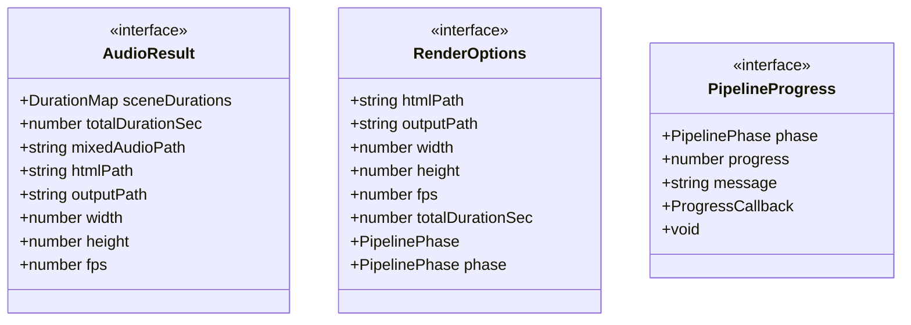

# Uml_From_Code_Diagram

> Auto-generated by Claude Workflow Engine | Last updated: 2026-08-22

```mermaid
classDiagram
    class AudioResult {
        <<interface>>
        +DurationMap sceneDurations
        +number totalDurationSec
        +string mixedAudioPath
        +string htmlPath
        +string outputPath
        +number width
        +number height
        +number fps
    }
    class RenderOptions {
        <<interface>>
        +string htmlPath
        +string outputPath
        +number width
        +number height
        +number fps
        +number totalDurationSec
        +PipelinePhase
        +PipelinePhase phase
    }
    class PipelineProgress {
        <<interface>>
        +PipelinePhase phase
        +number progress
        +string message
        +ProgressCallback
        +void
    }
```

## Notes

- Generated from: /home/khxnh/Documents/project/vidtml
- Scope: Full project
