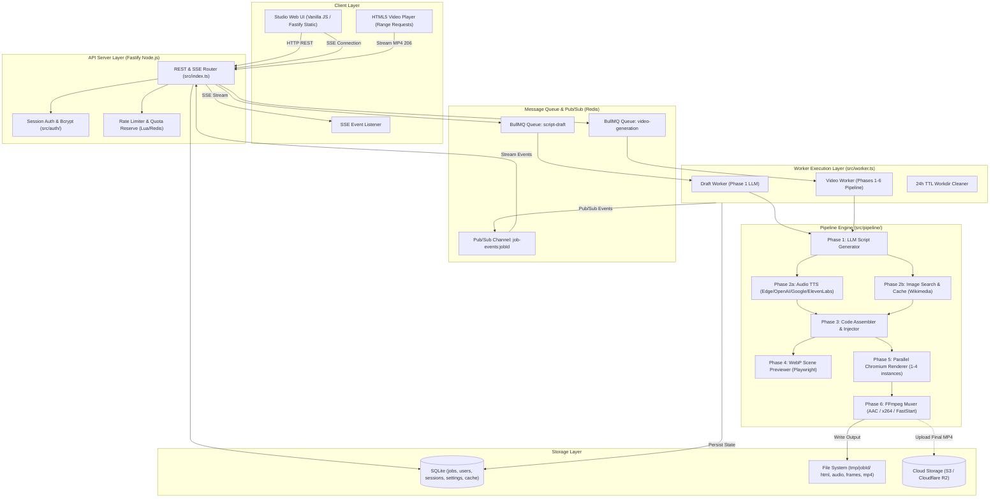
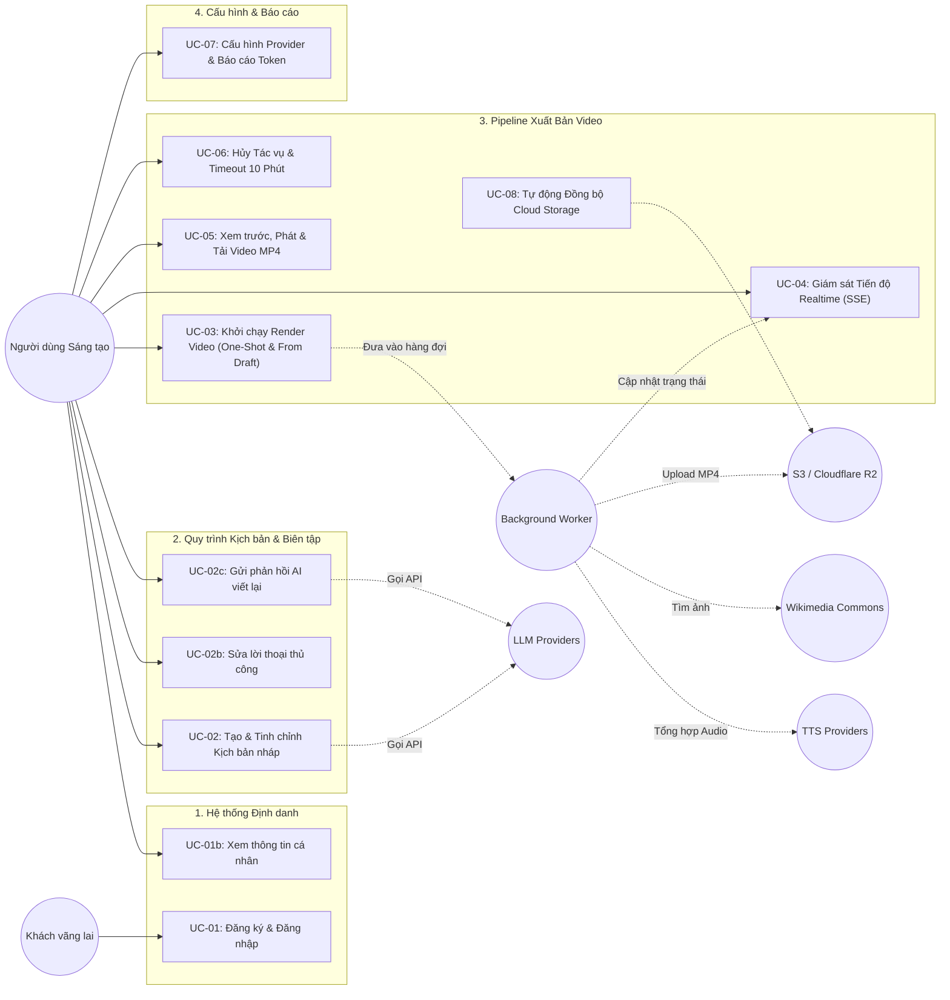

# BỘ TÀI LIỆU ĐẶC TẢ HỆ THỐNG VIDTML (SYSTEM SPECIFICATIONS & API SUITE)

> **Dự án:** VidTML — Nền tảng tạo Video tự động từ HTML/CSS/GSAP & AI TTS  
> **Phiên bản:** 1.2.0  
> **Ngày cập nhật:** 25/08/2026  
> **Tác giả:** Đội ngũ Kỹ thuật VidTML  

---

## MỤC LỤC

1. [Tài liệu Đặc tả Yêu cầu Phần mềm (SRS - Software Requirements Specification)](#1-tài-liệu-đặc-tả-yêu-cầu-phần-mềm-srs)
   - 1.1. Tổng quan & Mục tiêu Hệ thống
   - 1.2. Kiến trúc Tổng thể (System Architecture)
   - 1.3. Mô hình Xử lý & Pipeline 6 Giai đoạn (6-Stage Pipeline)
   - 1.4. Yêu cầu Chức năng (Functional Requirements - FR)
   - 1.5. Yêu cầu Phi chức năng (Non-Functional Requirements - NFR)
   - 1.6. Mô hình Dữ liệu (Database Schema & Storage Model)
   - 1.7. Hợp đồng Kỹ thuật Render (HTML ↔ Renderer Contract)
   - 1.8. Bộ Quy tắc Nghiệp vụ Cốt lõi (Core Business Rules - BR)
2. [Tập hợp User Stories (Agile User Stories & Acceptance Criteria)](#2-tập-hợp-user-stories)
   - Epic 1: Quản trị Tài khoản & Không gian làm việc (Auth & Workspace)
   - Epic 2: Khởi tạo & Tinh chỉnh Kịch bản Video (Two-Phase AI Script Generation)
   - Epic 3: Pipeline Render Video Phân tán Đa luồng (Multi-Process Rendering)
   - Epic 4: Giám sát Trực tiếp Tiến độ & Tương tác Video (Realtime Tracking & Playback)
   - Epic 5: Cấu hình Nhà cung cấp, Lưu trữ Đám mây & Quản lý Hạn ngạch (Settings & Quota)
3. [Đặc tả Use Case Chi tiết (Use Case Specifications & Flow of Events)](#3-đặc-tả-use-case-chi-tiết)
   - 3.1. Sơ đồ Tổng quan Use Case
   - 3.2. Chi tiết từng Use Case (UC-01 đến UC-08)
4. [Tài liệu Đặc tả API Chuẩn RESTful & SSE (API Documents)](#4-tài-liệu-đặc-tả-api-chuẩn-restful--sse)
   - 4.1. Quy chuẩn chung & Mã lỗi
   - 4.2. Nhóm Authentication API (`/api/auth/*`)
   - 4.3. Nhóm Cấu hình & Chẩn đoán (`/api/health`, `/api/settings`, `/api/usage`)
   - 4.4. Nhóm Kịch bản & Tác vụ Render Video (`/api/script/draft`, `/api/generate`, `/api/jobs/*`)

---

# 1. TÀI LIỆU ĐẶC TẢ YÊU CẦU PHẦN MỀM (SRS)

## 1.1. Tổng quan & Mục tiêu Hệ thống
**VidTML** là hệ thống AI tạo video tự động thế hệ mới, biến prompt ngôn ngữ tự nhiên thành video hoàn chỉnh bằng cách kết hợp:
1. **LLM (Large Language Model):** Lập trình kịch bản động với mã HTML/CSS và diễn hoạt GSAP per-scene kèm nội dung thuyết minh (voiceover).
2. **AI TTS (Text-To-Speech):** Chuyển đổi voiceover thành giọng đọc tự nhiên đa ngôn ngữ, đo lường thời lượng chính xác từng mili-giây.
3. **Semantic Image Search:** Thu thập hình ảnh theo ngữ cảnh từ Wikimedia Commons (miễn phí, không cần API key).
4. **Headless Chromium & Parallel Rendering:** Render từng cảnh song song trên các Chromium instances cô lập, trích xuất khung hình PNG. Renderer chỉ được truy cập các asset đã được tải/cho phép trước; mọi URL, điều hướng và truy cập file khác đều bị chặn.
5. **FFmpeg Pipeline:** Muxing âm thanh, hình ảnh, nhạc nền thành định dạng chuẩn MP4 (H.264 / AAC) với tốc độ cao.

Hệ thống cung cấp quy trình 2 giai đoạn (**Two-Phase Workflow**): Tạo và chỉnh sửa bản nháp kịch bản (Script Draft & AI Feedback) trước khi render, giúp tiết kiệm chi phí và tối ưu trải nghiệm sáng tạo.

---

## 1.2. Kiến trúc Tổng thể (System Architecture)



---

## 1.3. Mô hình Xử lý & Pipeline 6 Giai đoạn

| Giai đoạn | Module | Cơ chế thực thi | Dữ liệu đầu vào | Dữ liệu đầu ra |
|---|---|---|---|---|
| **Phase 1** | `scriptGenerator.ts` | Gọi LLM (OpenAI/Gemini/Claude/DeepSeek), ép kiểu Zod schema, tự sửa lỗi tối đa 3 lần nếu vi phạm cú pháp JS / schema. | `VideoRequest` (prompt, ratio, duration, style) | `VideoScript` (mảng scenes, CSS, GSAP JS) |
| **Phase 2a** | `audioSynth.ts` | Chuyển đổi văn bản `voiceoverText` từng scene sang MP3 qua TTS provider, dùng `ffprobe` đo thời lượng từng scene (`sceneDurations`). Trộn BGM (nếu có). Chạy song song Phase 2b. | `voiceoverText`, TTS Config | `sceneDurations`, `mixedAudioPath` |
| **Phase 2b** | `imageGenerator.ts` | Tìm kiếm ảnh Wikimedia Commons theo `imagePrompt` (0-3 từ khóa/scene). Cache kết quả vào SQLite `image_search_cache`. Thay thế fallback nếu lỗi. Chạy song song Phase 2a. | `imagePrompt[]` | Danh sách đường dẫn ảnh per-scene |
| **Phase 3** | `codeAssembler.ts` | Điền token có namespace `{{SCENE_<sceneId>_DURATION}}` thực tế từ Phase 2a và `{{SCENE_<sceneId>_IMAGE_<n>}}` bằng asset allowlist/fallback; tiêm GSAP Plugins và Helper methods; đóng gói thành file `index.html` hoàn chỉnh. | `VideoScript`, `sceneDurations`, image paths | File `html/index.html` tự trị |
| **Phase 4** | `previewer.ts` | Playwright mở Chromium, điều hướng timeline GSAP đến điểm giữa từng scene (midpoint), chụp snapshot lưu thành ảnh WebP. | `html/index.html`, `sceneDurations` | Mảng thumbnail WebP per-scene |
| **Phase 5** | `parallelRenderer.ts` | Chia timeline video thành các đoạn scene nhỏ, render song song qua nhiều Chromium instances cô lập (≤ `RENDER_MAX_CONCURRENCY`), pipe trực tiếp ảnh PNG vào `ffmpeg image2pipe` (x264). Ghép nối video chunks không cần re-encode qua ffmpeg concat. | `html/index.html`, resolution, FPS | `raw_video.mp4` (không âm thanh) |
| **Phase 6** | `muxer.ts` | Ghép video từ Phase 5 với file âm thanh `mixed_audio.mp3` từ Phase 2a bằng `ffmpeg -c:v copy -c:a aac -shortest -movflags +faststart`. Tự động đồng bộ lên Cloud Storage nếu được kích hoạt. | `raw_video.mp4`, `mixed_audio.mp3` | File `final.mp4` tối ưu phát web |

---

## 1.4. Yêu cầu Chức năng (Functional Requirements - FR)

- **FR-01: Quản lý Định danh & Phiên làm việc (Authentication & Sessions)**
  - Cho phép người dùng đăng ký tài khoản truyền thống (`username`, `password`, `email` tùy chọn).
  - **Hỗ trợ Đăng nhập & Đăng ký 1-click bằng tài khoản Google (Google OAuth 2.0 SSO)**.
  - Xác thực đăng nhập qua mật khẩu băm chuẩn bcrypt (cost factor 10) hoặc qua Google ID Token.
  - Quản lý phiên làm việc không trạng thái phía client thông qua HttpOnly Cookie (`vidtml_session`), lưu SHA-256 token hash trong SQLite, thời hạn 7 ngày.
- **FR-02: Tạo Kịch bản Nháp 2 Giai đoạn (Two-Phase Script Draft Generation)**
  - Cho phép người dùng gửi prompt mô tả ý tưởng để tạo bản nháp kịch bản (`POST /api/script/draft`).
  - Hỗ trợ gửi phản hồi tinh chỉnh kịch bản bằng AI (`draftJobId` + `feedback`).
  - Cho phép xem trước danh sách scene, tiêu đề, mô tả thị giác và nội dung thuyết minh trước khi render.
- **FR-03: Chỉnh sửa Thủ công & Tái sử dụng Bản nháp (Reusable Draft Script Editing)**
  - Người dùng có thể trực tiếp sửa tiêu đề (`title`) và lời thoại (`voiceoverText`) của từng scene trên Web UI.
  - Bản nháp gốc vẫn được lưu trữ độc lập ở trạng thái `draft` sau khi render, cho phép tạo ra nhiều phiên bản video phái sinh.
  - Hệ thống tự động làm sạch ký tự điều khiển độc hại (`sanitizeScriptText`) trước khi đưa vào pipeline render.
- **FR-04: Khởi chạy Render Video & Quản lý Hạn ngạch (Video Rendering Engine & Quotas)**
  - Hỗ trợ khởi chạy trực tiếp từ prompt hoặc từ bản nháp kịch bản đã duyệt.
  - Hỗ trợ 4 tỷ lệ khung hình chuẩn: `16:9` (1920x1080), `9:16` (1080x1920), `1:1` (1080x1080), `4:3` (1440x1080).
  - Tự động kiểm tra và giữ slot hạn ngạch nguyên tử (Atomic Hold/Reconcile).
- **FR-05: Giám sát Tiến độ Trực tiếp qua SSE (Realtime Event Streaming)**
  - Truyền phát tiến trình từng giai đoạn (phase, % hoàn thành, message) qua Server-Sent Events (SSE).
  - Lưu trữ lịch sử log (tối đa 15 logs gần nhất) trong bảng `job_logs` để phục vụ khôi phục trạng thái.
- **FR-06: Phát Video, Xem trước & Tải về Thành phẩm (Streaming & Export)**
  - Hỗ trợ phát video trực tiếp trên giao diện với chuẩn HTTP Range Request (mã phản hồi 206 Partial Content).
  - Cho phép tải về file `.mp4` chuẩn đính kèm (`Content-Disposition: attachment`).
  - Cung cấp ảnh thumbnail WebP xem trước từng phân cảnh.
  - Tích hợp Cloud Storage (S3 / Cloudflare R2) lưu trữ vĩnh viễn cho tài khoản có đăng ký lưu trữ.
- **FR-07: Huỷ tác vụ, Timeout & Hoàn trả Hạn ngạch (Cancellation, Hard Timeout & Quota Reconcile)**
  - Cho phép hủy tác vụ đang chờ hoặc đang chạy (`DELETE /api/jobs/:id`).
  - Hủy là một chuyển trạng thái bất đồng bộ (`queued|running` → `cancelling` → `cancelled`), **không xóa ngay bản ghi job**. Việc xóa/ẩn lịch sử là thao tác riêng sau khi worker đã dừng.
  - Áp dụng cơ chế **Hard Timeout 10 phút**: Tự động hủy tác vụ treo, kill subprocesses và hoàn trả slot hạn ngạch.
- **FR-08: Tùy biến Nhà cung cấp Runtime & Báo cáo Chi phí Token (Provider Settings & Cost)**
  - Cho phép chuyển đổi linh hoạt nhà cung cấp AI LLM (`openai`, `gemini`, `claude`, `deepseek`) và TTS (`edge`, `openai`, `google`, `elevenlabs`) trên từng tài khoản người dùng.
  - Tự động ghi nhận số token sử dụng (Prompt Tokens, Completion Tokens, USD Cost) vào log JSONL và cung cấp báo cáo chi phí qua `/api/usage`.

---

## 1.5. Yêu cầu Phi chức năng (Non-Functional Requirements - NFR)

- **NFR-01: Hiệu năng & Tốc độ Render (Performance)**
  - Với video 60 giây, 1080p, 30 FPS, 5 scenes, asset đã cache và không tính thời gian chờ provider bên ngoài, thời gian Phase 2–6 phải ≤45 giây tại p95 trên cấu hình tham chiếu 8 vCPU / 16 GB RAM / SSD NVMe, khi mỗi host chạy tối đa một render job. Kết quả benchmark phải ghi rõ phiên bản Chromium/FFmpeg và `RENDER_MAX_CONCURRENCY`.
- **NFR-02: Kiểm soát Tải & Hạn ngạch Đột biến (Concurrency & Quota Management)**
  - Áp dụng cơ chế **Two-Phase Atomic Reservation** sử dụng Redis Lua Scripts:
    - Giới hạn tác vụ chạy đồng thời: Tối đa 3 jobs/user (`QUOTA_MAX_CONCURRENT_JOBS`).
    - Giới hạn tác vụ trong ngày: Tối đa 20 jobs/ngày (`QUOTA_MAX_DAILY_JOBS`).
    - Giới hạn ngân sách chi phí ngày (`QUOTA_DAILY_BUDGET_USD`).
  - Rate Limiting phân tán qua Redis: 10 lần đăng nhập sai/15 phút/IP, 20 lần đăng ký/giờ/IP, 30 lần gửi yêu cầu tạo/phút/user.
- **NFR-03: Bảo mật & Cô lập Môi trường Thực thi (Security & Sandboxing)**
  - Mã JavaScript/CSS do LLM tạo ra chỉ được thực thi trong môi trường Headless Chromium có cờ OS Sandbox mặc định (`RENDER_ALLOW_NO_SANDBOX=0`).
  - `scriptValidator.ts` là lớp phòng vệ bổ sung, không phải sandbox: cấm `eval`, `Function`, `fetch`, `XMLHttpRequest`, WebSocket, `localStorage` và các timer bất đồng bộ.
  - Playwright bắt buộc chặn tất cả network requests, navigation, popup và service worker; chỉ cho phép `data:`, `blob:` và asset nằm dưới thư mục workdir của job. Cấm `file:` ngoài workdir, `http(s):`, `<iframe>`, `<object>`, `<embed>`, `<meta http-equiv=refresh>`, `<link>` và CSS `url()` không trỏ tới asset đã allowlist. Áp CSP tương ứng khi mở HTML.
  - Cookie `vidtml_session` cấu hình `HttpOnly`, `SameSite=Lax`, `Secure` trên môi trường Production.
  - Xác thực sở hữu tác vụ chặt chẽ (Multi-tenant data isolation): Trả về `404 Not Found` đồng nhất nếu job không tồn tại hoặc không thuộc sở hữu của user (tránh rò rỉ ID enumeration).
- **NFR-04: Độ tin cậy, Timeout & Khả năng Chịu lỗi (Reliability & Resilience)**
  - Queue BullMQ lưu trữ bền vững trên Redis; trạng thái jobs và logs được ghi đồng bộ vào SQLite (WAL mode).
  - Tự động kích hoạt Hard Timeout sau 10 phút chạy để triệt tiêu tình trạng treo tiến trình con (Zombie Chromium/FFmpeg).
  - Tiến trình dọn dẹp tự động định kỳ 30 phút xóa các thư mục tạm và file cục bộ cũ hơn 24 giờ để chống tràn dung lượng đĩa cứng.

---

## 1.6. Mô hình Dữ liệu (Database Schema & Storage Model)

### Bảng Cơ sở Dữ liệu SQLite (`tmp/vidtml.sqlite`)

```sql
-- 1. Bảng Quản lý Người dùng (Hỗ trợ Local Password & Google OAuth)
CREATE TABLE IF NOT EXISTS users (
  id TEXT PRIMARY KEY,
  username TEXT NOT NULL UNIQUE COLLATE NOCASE,
  email TEXT UNIQUE COLLATE NOCASE,
  password_hash TEXT, -- Cho phép NULL nếu đăng ký/đăng nhập hoàn toàn qua Google OAuth
  google_id TEXT UNIQUE, -- Google Subject/ID từ OAuth 2.0 token
  avatar_url TEXT,
  created_at INTEGER NOT NULL
);
CREATE INDEX IF NOT EXISTS idx_users_google_id ON users(google_id);

-- 2. Bảng Quản lý Phiên làm việc (Session)
CREATE TABLE IF NOT EXISTS sessions (
  token_hash TEXT PRIMARY KEY,
  user_id TEXT NOT NULL REFERENCES users(id) ON DELETE CASCADE,
  expires_at INTEGER NOT NULL
);
CREATE INDEX IF NOT EXISTS idx_sessions_user_id ON sessions(user_id);
CREATE INDEX IF NOT EXISTS idx_sessions_expires_at ON sessions(expires_at);

-- 3. Bảng Quản lý Tác vụ Video & Bản nháp
CREATE TABLE IF NOT EXISTS jobs (
  id TEXT PRIMARY KEY,
  user_id TEXT NOT NULL REFERENCES users(id) ON DELETE CASCADE,
  job_type TEXT NOT NULL CHECK(job_type IN ('draft_generation', 'render')),
  status TEXT NOT NULL CHECK(status IN ('queued', 'running', 'cancelling', 'cancelled', 'completed', 'failed', 'draft')),
  request_json TEXT NOT NULL,
  result_json TEXT,
  script_json TEXT,
  draft_job_id TEXT REFERENCES jobs(id) ON DELETE RESTRICT,
  parent_draft_job_id TEXT REFERENCES jobs(id) ON DELETE RESTRICT,
  error_message TEXT,
  cancel_requested_at INTEGER,
  finished_at INTEGER,
  quota_released_at INTEGER,
  deleted_at INTEGER,
  created_at INTEGER NOT NULL,
  updated_at INTEGER NOT NULL
);
CREATE INDEX IF NOT EXISTS idx_jobs_user_id ON jobs(user_id);
CREATE INDEX IF NOT EXISTS idx_jobs_status ON jobs(status);
CREATE INDEX IF NOT EXISTS idx_jobs_draft_job_id ON jobs(draft_job_id);
CREATE INDEX IF NOT EXISTS idx_jobs_parent_draft_job_id ON jobs(parent_draft_job_id);

-- 4. Bảng Ghi nhận Tiến trình Từng bước (Job Logs)
CREATE TABLE IF NOT EXISTS job_logs (
  id INTEGER PRIMARY KEY AUTOINCREMENT,
  job_id TEXT NOT NULL REFERENCES jobs(id) ON DELETE CASCADE,
  phase TEXT NOT NULL,
  progress INTEGER NOT NULL,
  message TEXT NOT NULL,
  timestamp INTEGER NOT NULL
);
CREATE INDEX IF NOT EXISTS idx_job_logs_job_id ON job_logs(job_id);

-- 5. Bảng Cấu hình Tuỳ biến của Người dùng (Settings)
CREATE TABLE IF NOT EXISTS settings (
  user_id TEXT NOT NULL REFERENCES users(id) ON DELETE CASCADE,
  key TEXT NOT NULL,
  value TEXT NOT NULL,
  updated_at INTEGER NOT NULL,
  PRIMARY KEY (user_id, key)
);

-- 6. Bảng Bộ nhớ đệm Tìm kiếm Hình ảnh Wikimedia
CREATE TABLE IF NOT EXISTS image_search_cache (
  query TEXT PRIMARY KEY COLLATE NOCASE,
  results_json TEXT NOT NULL,
  created_at INTEGER NOT NULL
);

-- 7. Sự kiện sử dụng phục vụ quota và báo cáo chi phí (nguồn dữ liệu chuẩn,
-- JSONL nếu có chỉ là bản export/audit append-only)
CREATE TABLE IF NOT EXISTS usage_events (
  id TEXT PRIMARY KEY,
  user_id TEXT NOT NULL REFERENCES users(id) ON DELETE CASCADE,
  job_id TEXT NOT NULL REFERENCES jobs(id) ON DELETE CASCADE,
  provider TEXT NOT NULL,
  model TEXT,
  prompt_tokens INTEGER NOT NULL DEFAULT 0 CHECK(prompt_tokens >= 0),
  completion_tokens INTEGER NOT NULL DEFAULT 0 CHECK(completion_tokens >= 0),
  cost_usd_micros INTEGER NOT NULL DEFAULT 0 CHECK(cost_usd_micros >= 0),
  occurred_at INTEGER NOT NULL
);
CREATE INDEX IF NOT EXISTS idx_usage_events_user_time ON usage_events(user_id, occurred_at);
```

> Mọi SQLite connection phải bật `PRAGMA foreign_keys = ON`. `quota_released_at` là khóa idempotency: chỉ Lua script được phép giải phóng quota khi trường này còn `NULL`.

---

## 1.7. Hợp đồng Kỹ thuật Render (HTML ↔ Renderer Contract)

Để pipeline Playwright & Chromium trích xuất chính xác từng khung hình theo thời gian, mã HTML/JS do LLM sinh ra phải tuân thủ nghiêm ngặt các tiêu chuẩn toàn cục:
1. **Biến cờ sẵn sàng:** `window.__ready = true` được kích hoạt ngay sau khi khởi tạo toàn bộ DOM và GSAP timeline.
2. **Hàm Seek đồng bộ:** `window.__seekTo(timeInSeconds)` nhận vào thời gian thực (giây) và lập tức điều hướng GSAP Master Timeline đến đúng vị trí để trình render chụp ảnh.
3. **Plumbing GSAP toàn cục:** Bắt buộc đăng ký Master Timeline qua `window.__masterTimeline` và `window.__registerScene(sceneId, timeline, duration)`.
4. **Trừu tượng hóa thời lượng:** Mã JS của từng scene **không được hardcode số giây**. Token phải có namespace scene: `{{SCENE_<sceneId>_DURATION}}` (ví dụ `{{SCENE_scene_1_DURATION}}`). `codeAssembler` thay thế chính xác bằng thời lượng TTS của scene đó.
5. **Khai báo hình ảnh:** HTML/CSS sử dụng `{{SCENE_<sceneId>_IMAGE_<n>}}`, trong đó `n` là index 1–3 tương ứng với `imagePrompt[n-1]`. Token không có asset phải được thay bằng data URI fallback đã định sẵn, không phải URL từ xa.
6. **Tuyệt đối cấm Timer bất đồng bộ:** Không sử dụng `setTimeout`, `setInterval`, `requestAnimationFrame` hay CSS `@keyframes` vì cơ chế seek không thể can thiệp các luồng này.

---

## 1.8. Bộ Quy tắc Nghiệp vụ Cốt lõi (Core Business Rules - BR)

- **`BR-01: Vòng đời Bản nháp Tái sử dụng (Reusable Draft Lifecycle)`**
  - Khi người dùng gửi yêu cầu render từ một bản nháp có sẵn (`POST /api/generate` kèm `draftJobId`), hệ thống tạo một Job Render độc lập (`newJobId`) mang liên kết `draft_job_id = draftJobId`.
  - Bản nháp gốc vẫn được **giữ nguyên ở trạng thái `draft` trong SQLite**. Người dùng có thể quay lại Studio, tiếp tục điều chỉnh lời thoại, phong cách và bấm Render để tạo ra nhiều phiên bản video phái sinh khác nhau từ cùng một khung kịch bản gốc.
  - AI feedback không được sửa/requeue bản nháp gốc. Hệ thống tạo một draft job mới (`newDraftJobId`, `parent_draft_job_id = draftJobId`); mọi version đã hoàn thành vẫn ở trạng thái `draft` và bất biến.
- **`BR-02: Cơ chế Hard Timeout 10 Phút & Tự động Giải phóng Hạn ngạch (10-Minute Timeout & Auto-Reconcile)`**
  - Mọi Job Render hoặc Draft Generation có thời gian thực thi tối đa là **10 phút (600 giây)**.
  - Nếu quá 10 phút mà tiến trình chưa hoàn tất: Worker tự động kích hoạt `AbortSignal`, ngắt toàn bộ tiến trình Chromium/FFmpeg con (`kill subprocess`), cập nhật trạng thái job thành `failed` với mã lỗi `JOB_EXECUTION_TIMEOUT`.
  - Hệ thống tự động thực hiện hoàn trả slot hạn ngạch (Quota Slot Release & Hold Reconcile) ngay lập tức để không gây tắc nghẽn tài nguyên của người dùng.
- **`BR-03: Chính sách Lưu trữ Phân tầng (Tiered Storage Policy - Local vs Cloud Storage)`**
  - **Tầng Cục bộ (Local Buffer):** File video (`final.mp4`), frame và thumbnail lưu tại `tmp/<jobId>/` trên server và sẽ bị dọn dẹp tự động sau **24 giờ** bởi tiến trình TTL Cleaner để giải phóng dung lượng ổ đĩa cục bộ.
  - **Tầng Đám mây (Persistent Cloud Storage):** Đối với các tài khoản người dùng kích hoạt lưu trữ vĩnh viễn (hoặc cấu hình S3 / Cloudflare R2), ngay sau khi Phase 6 (Muxer) hoàn tất, video sẽ được đẩy lên Cloud Storage. Khi file local bị xóa sau 24h, API phát video và tải file sẽ chuyển hướng (redirect) hoặc cung cấp Presigned Cloud URL thay vì trả về `410 Gone`.
- **`BR-04: Xử lý Ngoại lệ Thất bại Kịch bản (Fail-Fast Script Validation & Provider Recommendation)`**
  - Khi LLM sinh mã HTML/CSS/GSAP vi phạm Zod Schema, sai cú pháp JS hoặc thiếu hàm theo hợp đồng Render, hệ thống tự động retry tối đa 3 lần kèm thông báo lỗi cụ thể gửi ngược lại LLM.
  - Nếu sau 3 lần retry vẫn không thành công: Hệ thống lập tức đánh dấu job là `failed`, trả về chi tiết danh sách vi phạm của validator, đồng thời hiển thị thông báo gợi ý người dùng đổi sang LLM Provider khác (ví dụ: GPT-4o, Claude Sonnet 4, DeepSeek) hoặc tinh chỉnh lại prompt.
- **`BR-05: Xác thực & Hợp nhất Tài khoản Google OAuth 2.0 (Account Linking & Seamless Onboarding)`**
  - Cho phép người dùng đăng ký hoặc đăng nhập chỉ bằng 1-click qua tài khoản Google.
  - Chỉ tự động liên kết khi email Google đã được Google xác nhận (`email_verified=true`) **và** email local đã được xác minh. Nếu tài khoản local chưa xác minh, yêu cầu người dùng đăng nhập bằng mật khẩu hiện có để xác nhận link.
  - OAuth `state` phải được lưu server-side hoặc trong cookie HttpOnly, TTL ≤10 phút, single-use và ràng buộc với browser; callback bắt buộc kiểm tra state. Tham số `redirect` chỉ nhận đường dẫn tương đối thuộc allowlist nội bộ.
  - Nếu là người dùng mới: tạo username đã chuẩn hóa theo regex; nếu trùng hoặc tên Google không hợp lệ, sinh suffix ngẫu nhiên. Không dùng trực tiếp `name` của Google làm username.

- **`BR-06: Nguồn ảnh, giấy phép và attribution`**
  - Mỗi asset từ Wikimedia phải lưu `sourceUrl`, `author`, `license`, `licenseUrl` trong `result_json`/metadata. Chỉ chọn license phù hợp với mục đích sử dụng đã cấu hình (mặc định: cho phép commercial reuse và attribution được tạo nếu license yêu cầu).
  - Hệ thống phải đưa attribution vào metadata tải về hoặc end-card khi cấu hình sản phẩm yêu cầu; không được xem mọi asset Wikimedia là miễn điều kiện.

---

# 2. TẬP HỢP USER STORIES (AGILE STORIES & ACCEPTANCE CRITERIA)

### EPIC 1: Quản trị Tài khoản & Không gian làm việc (Auth & Workspace)

#### `US-01`: Đăng ký tài khoản mới (Truyền thống)
- **Là:** Người sáng tạo nội dung mới.
- **Tôi muốn:** Đăng ký tài khoản bằng username và mật khẩu.
- **Để:** Lưu trữ và quản lý các video kịch bản của riêng tôi một cách an toàn.
- **Độ ưu tiên:** Must-have.
- **Tiêu chí chấp nhận (Given-When-Then):**
  - **Kịch bản 1 (Thành công):**
    - *Given:* Tôi đang ở trang Đăng ký và nhập username `khxnh_dev` (3-30 ký tự hợp lệ), mật khẩu `SecurePass123!`.
    - *When:* Tôi nhấn nút "Tạo tài khoản".
    - *Then:* Hệ thống tạo tài khoản mới trong SQLite, tự động đăng nhập, trả về mã trạng thái `201 Created` và gán Cookie `vidtml_session` (HttpOnly).
  - **Kịch bản 2 (Tên đăng nhập đã tồn tại):**
    - *Given:* Tài khoản `khxnh_dev` đã tồn tại trên hệ thống.
    - *When:* Người khác cố gắng đăng ký với username `khxnh_dev`.
    - *Then:* Hệ thống từ chối với mã `409 Conflict` và hiển thị thông báo lỗi "Tên đăng nhập hoặc email đã tồn tại."

#### `US-01b`: Đăng nhập & Đăng ký nhanh 1-Click bằng Google Account (Google OAuth 2.0 SSO)
- **Là:** Người dùng muốn bắt đầu nhanh chóng mà không cần nhớ mật khẩu.
- **Tôi muốn:** Nhấn nút "Tiếp tục với Google" để đăng nhập hoặc đăng ký tài khoản ngay lập tức.
- **Để:** Tiết kiệm thời gian và tăng tính tiện lợi, an toàn.
- **Độ ưu tiên:** Must-have.
- **Tiêu chí chấp nhận (Given-When-Then):**
  - **Kịch bản 1 (Đăng nhập lần đầu - Tự động Onboarding):**
    - *Given:* Tôi chưa từng có tài khoản VidTML và nhấn "Tiếp tục với Google".
    - *When:* Tôi chấp thuận cấp quyền trên màn hình Google OAuth Consent.
    - *Then:* Google chuyển hướng về Callback, hệ thống tự động trích xuất thông tin Google Profile (`email`, `name`, `picture`), tạo người dùng mới với `google_id`, thiết lập cookie `vidtml_session` và chuyển hướng thẳng vào Studio.
  - **Kịch bản 2 (Hợp nhất với tài khoản email đã có sẵn):**
    - *Given:* Tôi từng đăng ký tài khoản bằng email `user@gmail.com` kèm mật khẩu trước đó.
    - *When:* Tôi chọn "Tiếp tục với Google" với cùng tài khoản `user@gmail.com`.
    - *Then:* Hệ thống nhận diện email trùng khớp, tự động liên kết `google_id` vào tài khoản cũ và đăng nhập thành công (`BR-05`).

#### `US-02`: Đăng nhập và duy trì phiên làm việc
- **Là:** Người dùng đã có tài khoản.
- **Tôi muốn:** Đăng nhập bằng tên đăng nhập và mật khẩu.
- **Để:** Truy cập vào Studio và các dự án video của tôi.
- **Độ ưu tiên:** Must-have.
- **Tiêu chí chấp nhận (Given-When-Then):**
  - **Kịch bản 1 (Đăng nhập thành công):**
    - *Given:* Tôi nhập đúng username và password.
    - *When:* Gửi yêu cầu đăng nhập.
    - *Then:* Hệ thống cấp cookie `vidtml_session` có hiệu lực trong 7 ngày và chuyển hướng tôi vào không gian Studio.
  - **Kịch bản 2 (Sai mật khẩu hoặc bị Rate Limit):**
    - *Given:* Tôi nhập sai mật khẩu quá 10 lần trong 15 phút.
    - *When:* Gửi yêu cầu tiếp theo.
    - *Then:* Hệ thống kích hoạt rate-limit, phản hồi mã `429 Too Many Requests` và yêu cầu thử lại sau.

---

### EPIC 2: Khởi tạo & Tinh chỉnh Kịch bản Video (Two-Phase AI Script Generation)

#### `US-03`: Tạo bản nháp kịch bản video bằng AI (Phase 1)
- **Là:** Nhà biên kịch / Video Creator.
- **Tôi muốn:** Nhập một mô tả ngắn gọn (prompt) về chủ đề video và chọn phong cách, tỷ lệ khung hình.
- **Để:** AI tạo ra toàn bộ phân cảnh, lời thoại và diễn hoạt mẫu trước khi tôi quyết định render.
- **Độ ưu tiên:** Must-have.
- **Tiêu chí chấp nhận (Given-When-Then):**
  - **Kịch bản 1 (Tạo bản nháp thành công):**
    - *Given:* Tôi đã đăng nhập và gửi prompt: "Giới thiệu 3 danh lam thắng cảnh Hà Nội", tỷ lệ `16:9`.
    - *When:* Gửi tới endpoint `POST /api/script/draft`.
    - *Then:* Hệ thống tiếp nhận với mã `202 Accepted`, worker xử lý sinh kịch bản JSON, cập nhật trạng thái job sang `draft` và phát sự kiện SSE `draft_ready`.
  - **Kịch bản 2 (Prompt không hợp lệ):**
    - *Given:* Tôi gửi prompt dưới 10 ký tự.
    - *When:* Gửi request.
    - *Then:* Hệ thống trả về mã `400 Bad Request` cùng danh sách lỗi Zod chi tiết.

#### `US-04`: Chỉnh sửa trực tiếp hoặc yêu cầu AI tái tạo kịch bản nháp
- **Là:** Người dùng đang duyệt bản nháp kịch bản.
- **Tôi muốn:** Trực tiếp chỉnh sửa văn bản lời thoại của từng scene hoặc gửi feedback phản hồi yêu cầu AI viết lại, trong khi vẫn bảo toàn bản nháp gốc.
- **Để:** Kịch bản đạt chất lượng mong muốn và có thể tái sử dụng để render nhiều phiên bản video khác nhau (theo `BR-01`).
- **Độ ưu tiên:** Must-have.
- **Tiêu chí chấp nhận (Given-When-Then):**
  - **Kịch bản 1 (Yêu cầu AI viết lại theo feedback):**
    - *Given:* Bản nháp `job-123` đang ở trạng thái `draft`.
    - *When:* Tôi gửi `{ "draftJobId": "job-123", "feedback": "Đổi giọng văn hài hước và ngắn hơn" }` tới `POST /api/script/draft`.
    - *Then:* Hệ thống tạo draft version mới (`newDraftJobId`, trạng thái `queued` -> `running`) trong hàng đợi `script-draft`; `job-123` vẫn ở trạng thái `draft` và nội dung không đổi.
  - **Kịch bản 2 (Sửa thủ công và render tạo Job phái sinh):**
    - *Given:* Tôi chỉnh sửa `voiceoverText` của Scene 1 trên giao diện Studio.
    - *When:* Nhấn nút "Bắt đầu Render Video".
    - *Then:* Hệ thống gửi payload kèm `scriptEdits` tới `POST /api/generate`, tạo một Job Render mới (`newJobId`) liên kết `draftJobId`, đồng thời bản nháp gốc `job-123` vẫn giữ nguyên trạng thái `draft` trong CSDL.

---

### EPIC 3: Pipeline Render Video Phân tán Đa luồng (Multi-Process Rendering)

#### `US-05`: Tự động lồng tiếng TTS và đồng bộ thời lượng hoạt họa
- **Là:** Hệ thống xử lý tự động (Background Worker).
- **Tôi muốn:** Chuyển đổi lời thoại thành file âm thanh và đo đạc chính xác thời lượng từng phân cảnh.
- **Để:** Diễn hoạt GSAP khớp từng mili-giây với giọng nói.
- **Độ ưu tiên:** Must-have.
- **Tiêu chí chấp nhận (Given-When-Then):**
  - *Given:* Bản kịch bản có 4 phân cảnh với nội dung lời thoại riêng biệt.
  - *When:* Giai đoạn `audio_synthesis` kích hoạt.
  - *Then:* Worker gọi TTS Engine để tạo các file MP3, dùng `ffprobe` đo thời lượng, ghi nhận bảng `sceneDurations` và điền vào token `{{SCENE_<sceneId>_DURATION}}` tương ứng.

#### `US-06`: Render khung hình song song qua Chromium cô lập & Xử lý Timeout
- **Là:** Người dùng đang chờ xuất video.
- **Tôi muốn:** Hệ thống chia nhỏ video và render song song trên nhiều tiến trình Chromium, đồng thời tự động dừng nếu bị treo quá 10 phút.
- **Để:** Nhận được video thành phẩm với tốc độ nhanh nhất và không bị tắc nghẽn hạn ngạch nếu có lỗi (theo `BR-02`).
- **Độ ưu tiên:** Must-have.
- **Tiêu chí chấp nhận (Given-When-Then):**
  - **Kịch bản 1 (Render bình thường):**
    - *Given:* Video 60 giây gồm 5 phân cảnh.
    - *When:* Giai đoạn `render` bắt đầu với `RENDER_MAX_CONCURRENCY=4`.
    - *Then:* Các instance Chromium khởi chạy, seek timeline và pipe PNG vào `ffmpeg`, ghép nối thành `raw_video.mp4` an toàn.
  - **Kịch bản 2 (Xử lý Timeout sau 10 phút):**
    - *Given:* Một tiến trình Chromium hoặc FFmpeg bị đơ/leak tài nguyên.
    - *When:* Tổng thời gian thực thi của job chạm ngưỡng 10 phút (600s).
    - *Then:* Worker ngắt toàn bộ tiến trình con, cập nhật status sang `failed` (lỗi `JOB_EXECUTION_TIMEOUT`), và giải phóng ngay slot hạn ngạch.

---

### EPIC 4: Giám sát Trực tiếp Tiến độ & Tương tác Video (Realtime Tracking & Playback)

#### `US-07`: Theo dõi tiến độ xử lý thời gian thực qua SSE
- **Là:** Người dùng đã gửi lệnh render.
- **Tôi muốn:** Nhìn thấy thanh tiến trình nhảy theo từng giai đoạn và thông điệp chi tiết.
- **Để:** Biết chính xác tác vụ đang ở bước nào mà không cần F5/tải lại trang.
- **Độ ưu tiên:** Must-have.
- **Tiêu chí chấp nhận (Given-When-Then):**
  - *Given:* Job `job-abc` đang được worker xử lý.
  - *When:* Trình duyệt mở kết nối SSE tới `/api/jobs/job-abc/events`.
    - *Then:* Client nhận các event có `id` tăng dần và có thể kết nối lại với `Last-Event-ID` mà không mất event. Với môi trường benchmark đã nêu ở NFR-01, độ trễ worker publish → server ghi stream phải <100ms tại p95 (không bao gồm mạng Internet của client).

#### `US-08`: Xem trực tuyến, Tải về và Lưu trữ Đám mây Vĩnh viễn
- **Là:** Người dùng có tác vụ render hoàn tất.
- **Tôi muốn:** Xem trực tiếp video trong player trên web (hỗ trợ tua), tải về máy tính và lưu trữ lâu dài trên Cloud Storage (S3 / Cloudflare R2).
- **Để:** Video không bị mất sau 24 giờ dọn dẹp file cục bộ (theo `BR-03`).
- **Độ ưu tiên:** Must-have.
- **Tiêu chí chấp nhận (Given-When-Then):**
  - **Kịch bản 1 (Xem và tải file cục bộ trong 24h):**
    - *Given:* Job vừa `completed` trong vòng 24h.
    - *When:* Tôi xem video hoặc nhấn "Download MP4".
    - *Then:* API `/api/jobs/:id/video` phục vụ mã 206, `/api/jobs/:id/download` trả về file đính kèm `vidtml_<id>.mp4`.
  - **Kịch bản 2 (Lưu trữ Cloud Storage sau khi hết hạn cục bộ):**
    - *Given:* Tài khoản có đăng ký lưu trữ Cloud Storage và video đã qua 24 giờ.
    - *When:* Tôi truy cập đường dẫn video.
    - *Then:* Hệ thống tự động chuyển hướng hoặc trả về Presigned URL tải từ S3 / Cloudflare R2 an toàn.

---

### EPIC 5: Cấu hình Nhà cung cấp & Quản lý Hạn ngạch (Settings & Quota)

#### `US-09`: Chuyển đổi nhà cung cấp AI/TTS linh hoạt
- **Là:** Người dùng quản trị hoặc sáng tạo nội dung.
- **Tôi muốn:** Tùy chọn chuyển đổi giữa OpenAI, Gemini, Claude, DeepSeek cho LLM và Edge TTS, Google, ElevenLabs cho giọng đọc.
- **Để:** Tối ưu hóa chi phí hoặc chất lượng giọng đọc theo nhu cầu từng dự án.
- **Độ ưu tiên:** Should-have.
- **Tiêu chí chấp nhận (Given-When-Then):**
  - *Given:* Tôi vào mục Cài đặt (Settings) trên giao diện.
  - *When:* Tôi chọn LLM là "DeepSeek" và TTS là "Edge TTS" rồi lưu.
  - *Then:* Lựa chọn được lưu vào bảng `settings` cho riêng tài khoản của tôi, ghi đè biến môi trường mặc định mà không cần khởi động lại server.

---

# 3. ĐẶC TẢ USE CASE CHI TIẾT (USE CASE SPECIFICATIONS)

## 3.1. Sơ đồ Tổng quan Use Case (Use Case Diagram)



---

## 3.2. Bảng Đặc tả Chi tiết từng Use Case

### Use Case `UC-01`: Đăng ký & Đăng nhập tài khoản (Local & Google OAuth 2.0)
- **Mã UC:** `UC-01`
- **Actor chính:** Khách vãng lai (Guest) / Người dùng (User)
- **Actor phụ:** Google OAuth 2.0 Authorization Server
- **Tiền điều kiện:** Hệ thống API Server đang hoạt động bình thường (`/api/health` trả về `ok`).
- **Hậu điều kiện:** Người dùng được cấp phiên đăng nhập hợp lệ qua Cookie `vidtml_session`.
- **Luồng sự kiện chính 1 (Đăng ký / Đăng nhập Mật khẩu truyền thống):**
  1. Người dùng mở trang web VidTML, chọn Đăng ký hoặc Đăng nhập.
  2. Người dùng nhập thông tin: `username` (3-30 ký tự), `password` (8-128 ký tự).
  3. Client gửi request tương ứng tới `POST /api/auth/register` hoặc `POST /api/auth/login`.
  4. Server xác thực dữ liệu qua Zod schema, kiểm tra Rate Limiter.
  5. Server kiểm tra thông tin tài khoản (băm bcrypt kiểm tra mật khẩu).
  6. Server tạo token ngẫu nhiên 32 bytes, lưu hash SHA-256 vào bảng `sessions` (TTL 7 ngày).
  7. Server trả về mã `200/201` kèm Cookie `vidtml_session` (HttpOnly, SameSite=Lax).
  8. Giao diện người dùng chuyển sang trạng thái đã đăng nhập và tải không gian Studio.
- **Luồng sự kiện chính 2 (Đăng nhập 1-Click bằng Google OAuth 2.0):**
  1. Người dùng nhấn nút "Tiếp tục với Google" trên giao diện Studio.
  2. Trình duyệt điều hướng tới `GET /api/auth/google`. Server sinh `state` chống CSRF và chuyển hướng (302 Redirect) người dùng sang trang Google OAuth Consent.
  3. Người dùng đăng nhập tài khoản Google và chấp thuận chia sẻ thông tin cơ bản (Profile, Email).
  4. Google chuyển hướng trình duyệt về `GET /api/auth/google/callback?code=...&state=...`.
  5. Server trao đổi mã `code` với Google lấy `id_token` / `access_token`, trích xuất `google_id`, `email`, `name`, `picture`.
    6. Server xác minh chữ ký/issuer/audience/nonce của ID token, `email_verified=true`, rồi tra cứu CSDL:
     - Nếu đã có `google_id`: đăng nhập.
     - Nếu trùng email local đã xác minh: liên kết `google_id`; nếu email local chưa xác minh, yêu cầu đăng nhập local để xác nhận liên kết.
     - Nếu là người dùng mới: tạo username đã chuẩn hóa, không trùng, rồi chèn bản ghi (`password_hash = NULL`, `avatar_url = picture`).
  7. Server cấp cookie `vidtml_session` (7 ngày) và chuyển hướng người dùng về trang Studio (`/`).
- **Luồng phụ / Ngoại lệ (Alternative & Exception Flows):**
  - *4a. Vi phạm Rate Limit:* Nếu IP gửi quá 20 lần đăng ký/giờ hoặc quá 10 lần đăng nhập sai/15 phút -> Server trả về mã `429 Too Many Requests`.
  - *5a. Trùng lặp username khi đăng ký thủ công:* Server trả về `409 Conflict` ("Tên đăng nhập hoặc email đã tồn tại."). Email local phải hoàn tất luồng xác minh trước khi được coi là đủ điều kiện auto-link OAuth.
  - *5b. Sai mật khẩu khi đăng nhập thủ công:* Server trả về `401 Unauthorized` (Thông điệp chung: "Invalid username or password" để tránh lộ thông tin người dùng).
  - *Google OAuth bị hủy hoặc lỗi token:* Nếu người dùng từ chối cấp quyền trên Google hoặc mã auth code hết hạn -> Server chuyển hướng về trang login kèm query param `?error=google_auth_failed`.

---

### Use Case `UC-02`: Tạo & Tinh chỉnh Kịch bản nháp Video (Two-Phase Script Draft)
- **Mã UC:** `UC-02`
- **Actor chính:** Người dùng đã đăng nhập (Authenticated User)
- **Actor phụ:** LLM Provider (OpenAI, Gemini, Claude, DeepSeek), Draft Worker
- **Tiền điều kiện:** Đã đăng nhập, chưa vượt quá giới hạn concurrent jobs.
- **Hậu điều kiện:** Một bản kịch bản video ở trạng thái `draft` được lưu trong SQLite kèm sự kiện `draft_ready`.
- **Luồng sự kiện chính (Happy Path):**
  1. Người dùng nhập prompt mô tả video (ví dụ: "Lịch sử hình thành Vạn Lý Trường Thành"), chọn tỷ lệ (`16:9`), thời lượng (`60s`), phong cách (`cinematic`).
  2. Người dùng nhấn nút "Tạo Kịch bản Nháp".
  3. Client gửi request `POST /api/script/draft`.
  4. Server xác thực quyền, kiểm tra quota áp dụng cho draft generation, lấy cấu hình LLM của user, tạo UUID `jobId`, tạo bản ghi job với `job_type=draft_generation`, status `queued` và đưa vào queue `script-draft`.
  5. Server phản hồi ngay mã `202 Accepted` kèm `jobId` và URL kết nối SSE.
  6. `draftWorker` tiếp nhận job từ queue, cập nhật status sang `running`, gọi LLM với `system.txt` prompt.
  7. LLM trả về cấu trúc kịch bản JSON (`VideoScriptSchema`).
  8. Worker kiểm tra hợp đồng kịch bản qua `scriptValidator.ts`. Nếu hợp lệ, worker gọi `finalizeDraft(jobId, script)`.
  9. Trạng thái job chuyển sang `draft`, kịch bản lưu vào cột `script_json`. Bản nháp này **được bảo toàn vĩnh viễn** để tái sử dụng (`BR-01`).
  10. Worker phát sự kiện `draft_ready` qua Redis Pub/Sub, client nhận qua SSE và hiển thị danh sách phân cảnh lên giao diện.
- **Luồng phụ / Ngoại lệ (Alternative & Exception Flows):**
  - *7a. LLM vi phạm Zod/GSAP hợp đồng sau 3 lần retry (`BR-04`):* Worker đánh dấu job là `failed`, trả về chi tiết vi phạm validator và gợi ý chuyển sang Model khác (như GPT-4o hoặc DeepSeek).
  - *8a. Người dùng gửi phản hồi AI viết lại (AI Feedback):* Người dùng gửi `{ "draftJobId": "<id>", "feedback": "Thêm yếu tố hài hước" }` -> Server tạo UUID `newDraftJobId`, sao chép input + feedback, đặt `parent_draft_job_id=<id>` và đưa job mới vào queue. Draft gốc không bị cập nhật hay chuyển trạng thái.

---

### Use Case `UC-03`: Khởi chạy Render Video Hoàn chỉnh
- **Mã UC:** `UC-03`
- **Actor chính:** Người dùng đã đăng nhập
- **Actor phụ:** Video Worker, Chromium Instances, FFmpeg, Wikimedia Commons, TTS Provider, Cloud Storage
- **Tiền điều kiện:** Người dùng gửi prompt trực tiếp HOẶC duyệt từ bản nháp `draft` có sẵn; còn hạn ngạch ngày & đồng thời.
- **Hậu điều kiện:** Video thành phẩm `final.mp4` được lưu trên đĩa (và Cloud Storage nếu có) và job đạt trạng thái `completed`.
- **Luồng sự kiện chính (Happy Path):**
  1. Người dùng xác nhận render từ bản nháp (`POST /api/generate` kèm `draftJobId` và các chỉnh sửa `scriptEdits`).
  2. Server thực thi hàm giữ hạn ngạch nguyên tử `reserveJobQuota` qua Redis Lua Script (kiểm tra max concurrent jobs <= 3, max daily jobs <= 20).
  3. Server tạo job render mới mang UUID riêng, `job_type=render`, lưu trường `draft_job_id` và giữ nguyên bản nháp gốc ở trạng thái `draft` (`BR-01`). Đưa job vào queue `video-generation`.
  4. Server phản hồi `202 Accepted`.
  5. `videoWorker` nhận job, cập nhật status `running`, thiết lập bộ đếm thời gian Hard Timeout 10 phút (`BR-02`), tạo thư mục làm việc `tmp/<jobId>/`.
  6. **(Phase 2a & 2b Song song):**
     - Worker gọi TTS tổng hợp giọng đọc từng scene -> Đo thời lượng bằng `ffprobe` -> Thu được `sceneDurations`.
     - Worker tìm kiếm ảnh theo `imagePrompt` trên Wikimedia Commons -> Tải về `tmp/<jobId>/html/images/`.
  7. **(Phase 3):** `codeAssembler` thay thế token thời lượng/ảnh có namespace scene bằng dữ liệu tương ứng và asset allowlist, đóng gói file `index.html`.
  8. **(Phase 4):** Playwright mở trang HTML, chụp ảnh WebP tại thời điểm giữa của từng scene để làm thumbnail.
  9. **(Phase 5):** `parallelRenderer` khởi chạy tối đa 4 tiến trình Chromium cô lập, chia đều timeline và pipe các khung hình PNG vào `ffmpeg` sinh file `raw_video.mp4`.
  10. **(Phase 6):** `muxer` kết hợp `raw_video.mp4` và `mixed_audio.mp3` thành `final.mp4`. Nếu cấu hình Cloud Storage được bật, tải file lên S3 / Cloudflare R2 (`BR-03`).
  11. Worker cập nhật trạng thái job thành `completed`, ghi nhận `result_json`, giải phóng slot hạn ngạch `reconcileJobQuota` và phát sự kiện `completed`.
- **Luồng phụ / Ngoại lệ (Alternative & Exception Flows):**
  - *2a. Vượt quá hạn ngạch:* Server từ chối ngay với mã `429 Too Many Requests` và lý do cụ thể.
  - *5a. Quá thời gian Hard Timeout 10 phút (`BR-02`):* Worker dừng ngay lập tức mọi tiến trình con (kill subprocesses), cập nhật status `failed` với thông báo `JOB_EXECUTION_TIMEOUT`, và hoàn trả hạn ngạch.
  - *6a. Wikimedia không tìm thấy ảnh:* Hệ thống tự động fallback lược bớt từ khóa; nếu vẫn không có, trả về ảnh trong suốt 1x1 GIF để không làm vỡ layout giao diện.

---

### Use Case `UC-04`: Giám sát Tiến độ Realtime (SSE)
- **Mã UC:** `UC-04`
- **Actor chính:** Client Web Browser
- **Actor phụ:** Redis Pub/Sub, Fastify SSE Handler (`src/sse.ts`)
- **Tiền điều kiện:** Job ID hợp lệ và thuộc quyền sở hữu của người dùng.
- **Luồng sự kiện chính:**
  1. Client kết nối `EventSource` tới endpoint `GET /api/jobs/:jobId/events`.
  2. Server kiểm tra quyền sở hữu job qua cookie phiên (`getOwnedJob`).
  3. Server thiết lập header `Content-Type: text/event-stream`, `Cache-Control: no-cache`.
  4. Server gửi snapshot hiện tại và replay các `job_logs` có ID lớn hơn `Last-Event-ID` (nếu có), rồi đăng ký lắng nghe kênh Redis Pub/Sub `job-events:<jobId>`.
  5. Mỗi event được ghi SQLite trước khi publish và có SSE `id` bằng `job_logs.id`; Worker phát `progress`, `draft_ready`, `completed`, `failed` hoặc `cancelled`.
  6. Server gửi heartbeat comment mỗi 15 giây. Khi nhận event kết thúc (`completed`, `failed`, `cancelled`), kết nối tự động đóng lại an toàn.

---

### Use Case `UC-05`: Xem trước, Phát & Tải Video MP4
- **Mã UC:** `UC-05`
- **Actor chính:** Người dùng đã đăng nhập
- **Tiền điều kiện:** Tác vụ video đã hoàn thành (`status = completed`).
- **Luồng sự kiện chính:**
  1. **Xem Thumbnail:** Client gọi `GET /api/jobs/:jobId/preview/:sceneId` -> Server trả về file ảnh `image/webp`.
  2. **Xem Trực tuyến (Streaming):** Trình phát video HTML5 gửi `GET /api/jobs/:jobId/video` kèm header `Range: bytes=0-`. Server trả về mã `206 Partial Content` kèm chunk dữ liệu video.
  3. **Tải về Video:** Người dùng nhấn nút "Tải về" -> Gửi request `GET /api/jobs/:jobId/download` -> Server trả về mã `200 OK` kèm header `Content-Disposition: attachment; filename="vidtml_<jobId>.mp4"`.
- **Luồng phụ:**
  - *File cục bộ đã bị xoá bởi TTL Cleaner 24h nhưng đã sync Cloud Storage (`BR-03`):* Server tự động chuyển hướng (302 Redirect) sang Presigned URL trên S3 / Cloudflare R2.
  - *File cục bộ đã bị xoá và không có Cloud Storage:* Server trả về mã `410 Gone` ("Video file has been cleaned up").

---

### Use Case `UC-06`: Hủy Tác vụ & Xử lý Timeout
- **Mã UC:** `UC-06`
- **Actor chính:** Người dùng đã đăng nhập / Hệ thống Worker Watchdog
- **Actor phụ:** Redis Pub/Sub, Worker AbortController
- **Tiền điều kiện:** Tác vụ đang ở trạng thái `queued` hoặc `running`.
- **Luồng sự kiện chính:**
  1. Người dùng nhấn nút "Hủy tác vụ" trên giao diện Studio (hoặc Watchdog kích hoạt khi quá 10 phút timeout).
  2. Client gửi request `DELETE /api/jobs/:jobId`.
  3. Server kiểm tra quyền sở hữu job.
  4. Server dùng Lua script idempotent để chuyển `queued|running` sang `cancelling`, đặt cờ Redis (`job-cancelled:<jobId>`) và giữ bản ghi SQLite.
  5. Worker đang chạy vòng lặp `watchJobCancellation` (chu kỳ ~0.4s) phát hiện cờ hủy -> Kích hoạt `AbortSignal` -> dừng LLM/TTS và kill Chromium/FFmpeg.
  6. Worker atomically chuyển sang `cancelled`, ghi event cuối và chỉ giải phóng quota nếu `quota_released_at IS NULL`. Server phản hồi `202 Accepted` cùng trạng thái `cancelling`.

---

### Use Case `UC-07`: Cấu hình Provider & Báo cáo Token
- **Mã UC:** `UC-07`
- **Actor chính:** Người dùng đã đăng nhập
- **Luồng sự kiện chính:**
  1. **Xem cấu hình:** Người dùng gửi `GET /api/settings` -> Server trả về danh sách các LLM và TTS providers được hỗ trợ cùng trạng thái cấu hình key.
  2. **Cập nhật cấu hình:** Người dùng gửi `PUT /api/settings` với `{ "llmProvider": "deepseek", "ttsProvider": "edge" }` -> Server lưu vào bảng `settings` theo `user_id`.
  3. **Xem báo cáo chi phí:** Người dùng gửi `GET /api/usage` -> Server tính toán tổng số token in/out và ước tính chi phí USD dựa trên bảng giá định cấu hình, trả về báo cáo tổng hợp.

---

# 4. TÀI LIỆU ĐẶC TẢ API CHUẨN RESTFUL & SSE (API DOCUMENTS)

## 4.1. Quy chuẩn chung & Mã lỗi

- **Base URL:** `http://localhost:3000` (hoặc domain triển khai)
- **Định dạng dữ liệu:** `application/json` (trừ các endpoint stream video và download file)
- **Cơ chế xác thực (Auth):** Các endpoint có ký hiệu 🔒 yêu cầu đính kèm cookie `vidtml_session`. Nếu thiếu hoặc hết hạn, API trả về `401 Unauthorized`.
- **CSRF:** Với mọi request thay đổi trạng thái dùng cookie, server kiểm tra `Origin`/`Referer` theo allowlist; production cookie luôn có `Secure`. OAuth callback dùng `state` theo `BR-05`.
- **Validation:** Request body phải là object không có field thừa. Enum: `aspectRatio ∈ {16:9,9:16,1:1,4:3}`, `language` là BCP-47 allowlist, `style` là allowlist sản phẩm, `targetDurationSec ∈ [5,600]`, `maxScenes ∈ [1,12]`. `prompt` và `feedback` phải được trim, lần lượt 10–2.000 và 1–2.000 ký tự. API draft/generate chấp nhận đúng một mode: prompt mode hoặc draft mode; `scriptEdits` chỉ nhận scene ID tồn tại, `title ≤160`, `voiceoverText ≤5.000` ký tự.
- **Idempotency:** `POST /api/script/draft` và `POST /api/generate` hỗ trợ `Idempotency-Key` (UUID, TTL 24h) để cùng key + cùng payload chỉ tạo một job.
- **Cấu trúc phản hồi lỗi chuẩn (Error Envelope):**
```json
{
  "error": "Mô tả ngắn gọn nguyên nhân lỗi",
  "details": [ /* Mảng chi tiết lỗi kiểm thực Zod (nếu có) */ ]
}
```

### Bảng Mã Trạng Thái HTTP (HTTP Status Codes)

| Mã | Ý nghĩa | Mô tả trong hệ thống VidTML |
|---|---|---|
| `200 OK` | Thành công | Yêu cầu xử lý đồng bộ thành công (lấy dữ liệu, đăng nhập, tải file). |
| `201 Created` | Đã tạo mới | Tạo tài khoản người dùng thành công. |
| `202 Accepted` | Đã tiếp nhận | Tác vụ tạo kịch bản nháp hoặc render video đã được đưa vào hàng đợi xử lý nền. |
| `206 Partial Content` | Nội dung phân đoạn | Trả về một phần dữ liệu video theo HTTP Range Header (phục vụ tua video). |
| `302 Found` | Chuyển hướng | Chuyển hướng sang Cloud Presigned URL khi file local đã hết hạn 24h (theo `BR-03`). |
| `400 Bad Request` | Yêu cầu không hợp lệ | Tham số không đúng định dạng hoặc vi phạm Zod Schema. |
| `401 Unauthorized` | Chưa xác thực | Không có cookie phiên hoặc phiên đăng nhập đã hết hạn. |
| `404 Not Found` | Không tìm thấy | Tài nguyên không tồn tại hoặc không thuộc quyền sở hữu của user. |
| `409 Conflict` | Xung đột tài nguyên | Trùng lặp username khi đăng ký hoặc tác vụ không ở trạng thái hợp lệ để thao tác. |
| `410 Gone` | Đã bị xóa vĩnh viễn | File video/preview đã bị dọn dẹp bởi tiến trình 24h TTL Cleaner (khi không bật Cloud Storage). |
| `416 Range Not Satisfiable` | Khoảng byte không hợp lệ | Header `Range` không hợp lệ hoặc nằm ngoài kích thước file; trả `Content-Range: bytes */<size>`. |
| `429 Too Many Requests` | Vượt quá tần suất / hạn ngạch | Bị chặn bởi Rate Limiter hoặc vượt quá giới hạn concurrent jobs / daily quota. |
| `503 Service Unavailable` | Phụ thuộc chưa sẵn sàng | Redis, queue, provider bắt buộc hoặc storage không khả dụng; response nêu retryability, không tạo/giữ quota dang dở. |
| `500 Internal Error` | Lỗi máy chủ nội bộ | Lỗi không mong muốn trong quá trình xử lý của server. |

---

## 4.2. Nhóm Authentication API (`/api/auth/*`)

### 1. Đăng ký tài khoản (`POST /api/auth/register`)
- **Mô tả:** Đăng ký tài khoản mới và tự động thiết lập phiên đăng nhập.
- **Quyền truy cập:** Công khai (Public).
- **Rate Limit:** Tối đa 20 lần đăng ký / giờ / IP.
- **Request Body Schema:**
```json
{
  "username": "string (3-30 ký tự, regex: ^[a-zA-Z0-9_]{3,30}$)",
  "password": "string (8-128 ký tự)",
  "email": "string (email hợp lệ hoặc để trống, tùy chọn)"
}
```
- **Response `201 Created`:**
```json
{
  "id": "a1b2c3d4e5f6...",
  "username": "creator_01",
  "email": "creator@example.com",
  "createdAt": 1756112400000
}
```
- **Set-Cookie Header:** `vidtml_session=<token_hex>; Path=/; HttpOnly; SameSite=Lax; Max-Age=604800`

---

### 2. Đăng nhập (`POST /api/auth/login`)
- **Mô tả:** Xác thực người dùng và cấp cookie phiên làm việc.
- **Quyền truy cập:** Công khai (Public).
- **Rate Limit:** Tối đa 10 lần thử thất bại / 15 phút / (IP + Username).
- **Request Body Schema:**
```json
{
  "username": "string",
  "password": "string"
}
```
- **Response `200 OK`:**
```json
{
  "id": "a1b2c3d4e5f6...",
  "username": "creator_01",
  "email": "creator@example.com",
  "createdAt": 1756112400000
}
```
- **Response `401 Unauthorized`:**
```json
{
  "error": "Invalid username or password"
}
```

---

### 3. Đăng xuất (`POST /api/auth/logout`)
- **Mô tả:** Xóa phiên làm việc hiện tại trong CSDL và xóa cookie trình duyệt.
- **Quyền truy cập:** Công khai (Thực thi an toàn ngay cả khi không có cookie).
- **Response `200 OK`:**
```json
{
  "ok": true
}
```

---

### 4. Lấy thông tin tài khoản hiện tại (`GET /api/auth/me`) 🔒
- **Mô tả:** Trả về thông tin hồ sơ của người dùng đang đăng nhập.
- **Quyền truy cập:** Yêu cầu đăng nhập (🔒).
- **Response `200 OK`:**
```json
{
  "id": "a1b2c3d4e5f6...",
  "username": "creator_01",
  "email": "creator@example.com",
  "avatarUrl": "https://lh3.googleusercontent.com/a/...",
  "createdAt": 1756112400000
}
```

---

### 5. Khởi tạo Đăng nhập Google OAuth 2.0 (`GET /api/auth/google`)
- **Mô tả:** Chuyển hướng người dùng sang trang Google OAuth 2.0 Consent Screen để xác thực tài khoản Google.
- **Quyền truy cập:** Công khai (Public).
- **Query Parameters (Tùy chọn):**
  - `redirect`: Đường dẫn tương đối thuộc allowlist cần quay lại sau khi đăng nhập (mặc định `/`); URL tuyệt đối và `//...` bị từ chối.
- **Response `302 Found`:**
  - `Location: https://accounts.google.com/o/oauth2/v2/auth?client_id=...&redirect_uri=...&response_type=code&scope=openid%20email%20profile&state=...`

---

### 6. Callback Xử lý Google OAuth (`GET /api/auth/google/callback`)
- **Mô tả:** Nhận authorization code từ Google, xác minh danh tính, tạo/liên kết tài khoản trong SQLite và cấp cookie phiên.
- **Quyền truy cập:** Công khai (Public do Google gọi về).
- **Query Parameters:**
  - `code`: Authorization code được Google cấp.
  - `state`: Chuỗi token chống tấn công CSRF.
- **Response `302 Found`:**
  - `Set-Cookie: vidtml_session=<token_hex>; Path=/; HttpOnly; SameSite=Lax; Max-Age=604800`
  - `Location: /` (Chuyển hướng về trang Studio chính)
- **Response `302 Found (Lỗi)`:**
  - `Location: /login?error=google_auth_failed` (Nếu người dùng hủy hoặc token không hợp lệ)

---

## 4.3. Nhóm Cấu hình & Chẩn đoán

### 1. Kiểm tra trạng thái hệ thống (`GET /api/health`)
- **Mô tả:** Kiểm tra kết nối tới SQLite và Redis Queue.
- **Quyền truy cập:** Công khai (Public).
- **Response `200 OK`:**
```json
{
  "status": "ok",
  "database": "sqlite_connected",
  "redis": "connected",
  "timestamp": "2026-08-25T10:30:00.000Z"
}
```

---

### 2. Lấy cấu hình Provider người dùng (`GET /api/settings`) 🔒
- **Mô tả:** Lấy danh sách các nhà cung cấp AI/TTS cùng lựa chọn hiện tại của người dùng.
- **Quyền truy cập:** Yêu cầu đăng nhập (🔒).
- **Response `200 OK`:**
```json
{
  "llm": {
    "provider": "deepseek",
    "available": [
      { "id": "openai", "label": "OpenAI (GPT)", "keyConfigured": true, "model": "gpt-4o" },
      { "id": "gemini", "label": "Google Gemini", "keyConfigured": true, "model": "gemini-2.5-pro" },
      { "id": "claude", "label": "Anthropic Claude", "keyConfigured": false, "model": "claude-sonnet-4-20250514" },
      { "id": "deepseek", "label": "DeepSeek", "keyConfigured": true, "model": "deepseek-chat" }
    ]
  },
  "tts": {
    "provider": "edge",
    "available": [
      { "id": "edge", "label": "Edge TTS (miễn phí)", "keyConfigured": true, "model": null },
      { "id": "openai", "label": "OpenAI", "keyConfigured": true, "model": null },
      { "id": "google", "label": "Google", "keyConfigured": false, "model": null },
      { "id": "elevenlabs", "label": "ElevenLabs", "keyConfigured": false, "model": null }
    ]
  }
}
```

---

### 3. Cập nhật cấu hình Provider (`PUT /api/settings`) 🔒
- **Mô tả:** Lưu thiết lập provider riêng cho tài khoản người dùng.
- **Quyền truy cập:** Yêu cầu đăng nhập (🔒).
- **Request Body Schema:**
```json
{
  "llmProvider": "deepseek",
  "ttsProvider": "edge"
}
```
- **Response `200 OK`:**
```json
{
  "ok": true
}
```

---

### 4. Báo cáo Chi phí & Token Usage (`GET /api/usage`) 🔒
- **Mô tả:** Tổng hợp số lượng token tiêu thụ và chi phí ước tính của người dùng.
- **Quyền truy cập:** Yêu cầu đăng nhập (🔒).
- **Response `200 OK`:**
```json
{
  "totalJobs": 12,
  "totalPromptTokens": 45200,
  "totalCompletionTokens": 18900,
  "totalCostUsd": 0.0845,
  "recentUsage": [
    {
      "jobId": "f7d24a8e-...",
      "timestamp": "2026-08-25T10:15:00.000Z",
      "provider": "deepseek",
      "model": "deepseek-chat",
      "promptTokens": 3200,
      "completionTokens": 1450,
      "costUsd": 0.0062
    }
  ]
}
```

---

## 4.4. Nhóm Kịch bản & Tác vụ Render Video

### 1. Tạo hoặc Tái tạo Kịch bản nháp (`POST /api/script/draft`) 🔒
- **Mô tả:** Khởi chạy tác vụ Phase 1 sinh kịch bản video bằng AI hoặc yêu cầu viết lại theo feedback.
- **Quyền truy cập:** Yêu cầu đăng nhập (🔒).
- **Rate Limit:** 30 requests / phút / user (`rl:generate`).
- **Request Body Schema (Trường hợp 1 - Tạo mới từ Prompt):**
```json
{
  "prompt": "Video ngắn 60s giới thiệu lịch sử phát minh ra máy tính cơ học",
  "aspectRatio": "16:9",
  "targetDurationSec": 60,
  "language": "vi",
  "style": "modern",
  "maxScenes": 5
}
```
- **Request Body Schema (Trường hợp 2 - Tái tạo theo Feedback):** Bản nháp nguồn phải thuộc user, có trạng thái `draft`; request này luôn tạo một draft version mới và không sửa draft nguồn.
```json
{
  "draftJobId": "9b1deb4d-3b7d-4bad-9bdd-2b0d7b3dcb6d",
  "feedback": "Hãy làm cho giọng đọc phân cảnh 2 cuốn hút hơn và dùng nhiều từ tượng hình"
}
```
- **Response `202 Accepted`:**
```json
{
  "message": "Script draft queued",
  "jobId": "9b1deb4d-3b7d-4bad-9bdd-2b0d7b3dcb6d",
  "checkStatusUrl": "/api/jobs/9b1deb4d-3b7d-4bad-9bdd-2b0d7b3dcb6d",
  "eventsUrl": "/api/jobs/9b1deb4d-3b7d-4bad-9bdd-2b0d7b3dcb6d/events"
}
```
  - Với feedback, `jobId` là `newDraftJobId` và response bổ sung `parentDraftJobId`.

---

### 2. Khởi chạy Render Video (`POST /api/generate`) 🔒
- **Mô tả:** Khởi tạo job render video hoàn chỉnh (chạy từ đầu hoặc chạy tiếp từ bản nháp đã duyệt, bảo toàn bản nháp gốc theo `BR-01`). Prompt mode tạo draft nội bộ chỉ thuộc render job, không xuất hiện như reusable draft.
- **Quyền truy cập:** Yêu cầu đăng nhập (🔒).
- **Rate Limit:** 30 requests / phút / user + Kiểm tra Quota Slot.
- **Request Body Schema (Trường hợp 1 - Render từ Bản nháp đã duyệt):**
```json
{
  "draftJobId": "9b1deb4d-3b7d-4bad-9bdd-2b0d7b3dcb6d",
  "scriptEdits": {
    "scene_1": {
      "title": "Mở đầu ấn tượng",
      "voiceoverText": "Bạn có biết chiếc máy tính đầu tiên hoạt động hoàn toàn bằng bánh răng cơ học?"
    }
  }
}
```
- **Request Body Schema (Trường hợp 2 - Render trực tiếp một bước từ Prompt):**
```json
{
  "prompt": "Top 3 sự thật thú vị về đại dương sâu thẳm",
  "aspectRatio": "9:16",
  "targetDurationSec": 45,
  "language": "vi",
  "style": "cinematic"
}
```
- **Response `202 Accepted`:**
```json
{
  "message": "Video generation queued from draft",
  "jobId": "e3b0c442-98fc-1c14-9afbf4c8996fb924",
  "checkStatusUrl": "/api/jobs/e3b0c442-98fc-1c14-9afbf4c8996fb924",
  "eventsUrl": "/api/jobs/e3b0c442-98fc-1c14-9afbf4c8996fb924/events"
}
```
- **Response `429 Too Many Requests` (Khi vượt quá hạn ngạch):**
```json
{
  "error": "Active concurrent job limit reached (max 3 concurrent jobs)",
  "quota": {
    "concurrent": 3,
    "maxConcurrent": 3,
    "dailyCount": 8,
    "maxDaily": 20
  }
}
```

---

### 3. Lấy Danh sách Tác vụ của Người dùng (`GET /api/jobs`) 🔒
- **Mô tả:** Lấy danh sách 50 tác vụ gần nhất thuộc sở hữu của người dùng.
- **Quyền truy cập:** Yêu cầu đăng nhập (🔒).
- **Response `200 OK`:**
```json
{
  "jobs": [
    {
      "id": "e3b0c442-98fc-1c14-9afbf4c8996fb924",
      "status": "completed",
      "createdAt": 1756112500000,
      "updatedAt": 1756112545000,
      "request": {
        "prompt": "Top 3 sự thật thú vị về đại dương sâu thẳm",
        "aspectRatio": "9:16"
      }
    }
  ]
}
```

---

### 4. Chi tiết Trạng thái Tác vụ (`GET /api/jobs/:jobId`) 🔒
- **Mô tả:** Lấy thông tin trạng thái, 15 logs mới nhất, nội dung kịch bản và kết quả xuất video. `status ∈ queued|running|cancelling|cancelled|completed|failed|draft`; response `failed` luôn có `error: { code, message, retryable }`, và `cancelled` có `cancelRequestedAt`/`finishedAt`.
- **Quyền truy cập:** Yêu cầu đăng nhập (🔒).
- **Response `200 OK` (Khi Job ở trạng thái `draft`):**
```json
{
  "id": "9b1deb4d-3b7d-4bad-9bdd-2b0d7b3dcb6d",
  "status": "draft",
  "progress": [
    { "phase": "script_generation", "progress": 100, "message": "Kịch bản đã sẵn sàng để chỉnh sửa" }
  ],
  "script": {
    "title": "Máy tính Cơ học",
    "description": "Lịch sử phát minh máy tính cơ học thế kỷ 19",
    "colorPalette": {
      "primary": "#2B4C7E",
      "secondary": "#4A7BB0",
      "accent": "#D4AF37",
      "background": "#0F172A",
      "text": "#F8FAFC"
    },
    "fontFamily": "Inter",
    "scenes": [
      {
        "id": "scene_1",
        "title": "Bình minh cơ học",
        "voiceoverText": "Năm 1822, Charles Babbage đã thai nghén cỗ máy Difference Engine.",
        "visualDescription": "Bánh răng đồng thau quay chậm rãi với ánh sáng điện ảnh.",
        "imagePrompt": ["Charles Babbage Difference Engine mechanical calculator"],
        "transition": "fade"
      }
    ]
  },
  "createdAt": 1756112400000,
  "updatedAt": 1756112415000
}
```
- **Response `200 OK` (Khi Job ở trạng thái `completed`):**
```json
{
  "id": "e3b0c442-98fc-1c14-9afbf4c8996fb924",
  "status": "completed",
  "progress": [
    { "phase": "mux", "progress": 100, "message": "Video đã sẵn sàng" }
  ],
  "result": {
    "videoPath": "tmp/e3b0c442-98fc-1c14-9afbf4c8996fb924/final.mp4",
    "cloudUrl": "https://storage.vidtml.io/renders/e3b0c442-98fc-1c14-9afbf4c8996fb924/final.mp4",
    "durationSec": 58.4,
    "scenes": 4,
    "resolution": "1080x1920",
    "videoUrl": "/api/jobs/e3b0c442-98fc-1c14-9afbf4c8996fb924/video",
    "downloadUrl": "/api/jobs/e3b0c442-98fc-1c14-9afbf4c8996fb924/download",
    "timing": {
      "script_generation": 4.2,
      "audio_synthesis": 6.8,
      "render": 18.5,
      "mux": 1.2,
      "total": 30.7
    }
  },
  "createdAt": 1756112500000,
  "updatedAt": 1756112545000
}
```

---

### 5. Luồng Sự kiện Tiến độ Thời gian thực (`GET /api/jobs/:jobId/events`) 🔒
- **Mô tả:** Server-Sent Events (SSE) phát sóng tiến trình từng giai đoạn.
- **Quyền truy cập:** Yêu cầu đăng nhập (🔒).
- **Headers:** `Content-Type: text/event-stream`, `Cache-Control: no-cache`
- **Reconnect:** Server gửi `id: <job_log_id>` cho mỗi event, hỗ trợ `Last-Event-ID`, replay tối đa 15 event còn lưu, gửi heartbeat `: keepalive` mỗi 15 giây. Client luôn phải gọi `GET /api/jobs/:jobId` sau reconnect nếu cursor cũ hơn log retention.
- **Ví dụ Data Stream:**
```text
event: progress
data: {"phase":"audio_synthesis","progress":35,"message":"Đang tổng hợp giọng đọc phân cảnh 2/4..."}

event: progress
data: {"phase":"render","progress":70,"message":"Đang render khung hình (Chromium Worker #2)..."}

event: completed
data: {"jobId":"e3b0c442-...","videoUrl":"/api/jobs/e3b0c442-.../video"}
```

---

### 6. Phát Video Trực tuyến (`GET /api/jobs/:jobId/video`) 🔒
- **Mô tả:** Phục vụ luồng phát video MP4 hỗ trợ tua nhanh qua HTTP Range Request.
- **Quyền truy cập:** Yêu cầu đăng nhập (🔒).
- **Request Headers (Tùy chọn):** `Range: bytes=1048576-2097151`
- **Response:**
  - `206 Partial Content` (Khi có header Range)
  - `200 OK` (Khi tải toàn bộ)
  - `302 Found` (Chuyển hướng sang Cloud Presigned URL nếu file local đã bị xóa sau 24h theo `BR-03`)
  - `416 Range Not Satisfiable` (Range không hợp lệ)
  - `Content-Type: video/mp4`
  - `Accept-Ranges: bytes`
  - `Content-Range: bytes 1048576-2097151/15482910`

---

### 7. Tải về Video Đính kèm (`GET /api/jobs/:jobId/download`) 🔒
- **Mô tả:** Tải file `.mp4` trực tiếp về thiết bị người dùng.
- **Quyền truy cập:** Yêu cầu đăng nhập (🔒).
- **Response `200 OK`:**
  - `Content-Type: video/mp4`
  - `Content-Disposition: attachment; filename="vidtml_e3b0c442-98fc-1c14-9afbf4c8996fb924.mp4"`

---

### 8. Lấy Thumbnail Xem trước Phân cảnh (`GET /api/jobs/:jobId/preview/:sceneId`) 🔒
- **Mô tả:** Trả về file ảnh snapshot WebP của phân cảnh tương ứng.
- **Quyền truy cập:** Yêu cầu đăng nhập (🔒).
- **Path Parameters:**
  - `jobId`: UUID của tác vụ
  - `sceneId`: Mã định danh phân cảnh (ví dụ: `scene_1`)
- **Response `200 OK`:**
  - `Content-Type: image/webp`

---

### 9. Hủy Tác vụ (`DELETE /api/jobs/:jobId`) 🔒
- **Mô tả:** Yêu cầu hủy tiến trình đang chạy (dừng subprocess Chromium/FFmpeg). Endpoint không xóa job; lịch sử `cancelled` vẫn đọc được để khôi phục UI/audit.
- **Quyền truy cập:** Yêu cầu đăng nhập (🔒).
- **Response `202 Accepted`:**
```json
{
  "message": "Cancellation requested — the job will stop shortly",
  "status": "cancelling"
}
```
- **Response `409 Conflict`:** Job đã ở trạng thái kết thúc hoặc đã `cancelling`.
- **Response `404 Not Found`:** Nếu job không tồn tại hoặc không thuộc sở hữu của người dùng hiện tại.

---
*(Hết tài liệu đặc tả hệ thống)*
